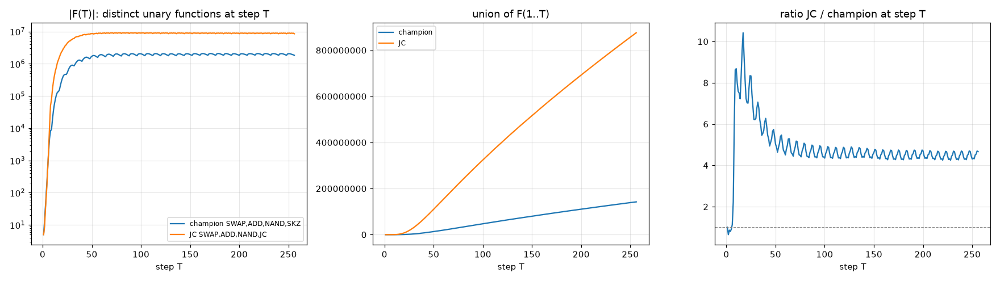

# exp09 comparison: the time axis of the champion ISA versus the exp05 winner SWAP,ADD,NAND,JC (unary, W=4, T = 1..256)

Both sweeps: all 4,294,967,296 programs at every step 1..256 with `gpu/u1_multi.cu` / `cluster/exp09_node.py`. Champion on knecht24 (3 x RTX 3060),
JC on adler40 (RTX 4090 + 4080: sweeps 10 min, merges 27 min). Per-step maps and unions on the nodes; summaries in `results/exp09/<name>/`.

| | champion | JC | JC / champion |
|---|---:|---:|---:|
| functions at step 256 (the old maps) | 1,829,051 | 8,533,818 | 4.7 |
| union over steps 1..256 | 142,263,973 | 875,798,276 | 6.2 |
| union / step-256 set | 77.8x | 102.6x | |
| richest single step | T = 179 (2,081,755) | T = 79 (9,140,092) | |
| functions at step 8 / 16 / 32 | 8,460 / 136,673 / 863,090 | 50,169 / 1,305,157 / 6,096,043 | 5.9 / 9.5 / 7.1 |
| first appearing at T <= 64 / 65-128 / 129-192 / 193-256 | 22,345,905 / 43,565,180 / 39,862,007 / 36,490,881 | 171,622,154 / 262,776,241 / 230,863,004 / 210,536,877 | |
| functions at exactly one step | 61,139,813 (43 %) | 487,962,554 (56 %) | |
| functions at 128 or more steps | 163,540 | 703,698 | 4.3 |
| functions at every step | 5 | 5 | |

## Reading

- JC's lead is largest early: 9.5x at step 16, settling to 4.7x at step 256. The carry-flag jump makes short runs expressive.
- JC's per-step count saturates by step 64 (peak at T = 79) and then stays near 8.6 M; the champion keeps ramping to its peak at T = 179.
- Over the whole clock JC realises 6.2x the champion's functions, more than its 4.7x at step 256: the time axis multiplies the lead.
- JC's functions are even more fleeting (56 % at one step only), but its persistent core is 4.3x larger (703,698 functions at 128 or more steps).
- Both ISAs keep adding functions at the end of the clock (JC: 211 M first seen in steps 193-256), so the JC library beyond 256 steps is worth sweeping too.

Binary versions of both maps at every step are being swept next (champion first); the Life worlds sample those, not the unary ones.
