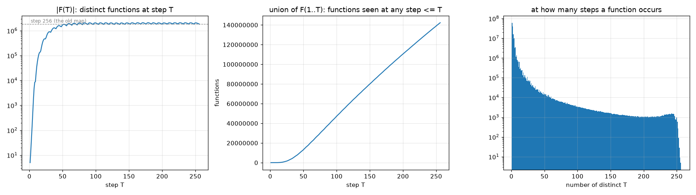

# exp09: every step of every program, champion ISA SWAP,ADD,NAND,SKZ (unary, W=4)

Run 2026-10-08 on knecht24 (three RTX 3060, CUDA) with `gpu/u1_multi.cu` and `cluster/exp09_node.py`; validation in `exp09_validation.md`;
spec in `docs/08_exp09_every_step.md`. All 4,294,967,296 programs, all 256 steps, full contiguous coverage at every step.

## Headline

- **142,263,973 distinct functions** occur at some step T = 1..256, **77.8x** the 1,829,051 functions of the step-256 map.
- The number of functions at a single step peaks at **T = 179 with 2,081,755**, above step 256 (1,829,051); step 255 has 1,889,463.
- New functions keep appearing at a nearly constant rate to the very end: 22,345,905 first appear at T <= 64, 43,565,180 at 65-128, 39,862,007 at 129-192, 36,490,881 at 193-256 (540,207 at step 256 alone). The library does not saturate at 256 steps.
- |F(T)| ripples with period 8 after T = 64: the program counter wraps every 8 instructions, so the set of reachable tables breathes with the program length.
- Functions are fleeting: 61,139,813 (43 %) occur at exactly one step, the median function at 2 steps, only 163,540 at 128 or more steps and 5 at every step (the 5 functions of step 1).

| T | distinct functions | first appearing at T | T | distinct functions | first appearing at T |
|---:|---:|---:|---:|---:|---:|
| 1 | 5 | 5 | 128 | 1,778,967 | 625,444 |
| 2 | 14 | 9 | 160 | 1,829,456 | 612,490 |
| 4 | 138 | 95 | 179 | 2,081,755 | 641,595 |
| 8 | 8,460 | 4,646 | 192 | 1,818,089 | 580,089 |
| 16 | 136,673 | 59,065 | 224 | 1,841,636 | 565,342 |
| 24 | 464,776 | 177,415 | 240 | 1,833,938 | 551,798 |
| 32 | 863,090 | 321,571 | 248 | 1,826,838 | 543,887 |
| 48 | 1,434,228 | 534,470 | 254 | 1,936,970 | 528,590 |
| 64 | 1,650,131 | 617,034 | 255 | 1,889,463 | 531,272 |
| 96 | 1,774,570 | 654,695 | 256 | 1,829,051 | 540,207 |

## Cost

| pass (steps) | GPU sweep, 3 x RTX 3060 | per-step merge (CPU) |
|---|---:|---:|
| 1-64 | 137 s | 109 s |
| 65-128 | 182 s | 204 s |
| 129-192 | 243 s | 200 s |
| 193-256 | 303 s | 198 s |

Total 14.4 min of GPU time plus 11.8 min of merging; the first pass simulates only 64 steps per input, the last one 256.
The kernel is as fast per program as the single-step sweep (14-15 M programs/s per RTX 3060 with 64 hash tables).

## Data

On knecht24 `universe-1/results/exp09/w4_o2_add/`: `T001.npy` .. `T256.npy` (per-step maps: key, minimum program; 11 GB together), `union.npy`
(142,263,973 records: key, minimal T, program at that T, number of steps at which it occurs; 2.3 GB), `summary.json`, `timings.json`. The summary,
timings, logs and this plot are in the repository under `results/exp09/w4_o2_add/`. The per-step maps are plain sorted record arrays readable with numpy
(`np.load`; dtype klo u8, khi u8, prog u4) and with the shard format of `results/witnesses/README.md` once wrapped in a header.

## What this changes

- A program is a trajectory through function space, and the step-256 maps saw only its last point: 1.3 % of what the champion ISA computes within the budget.
- The time axis is as productive at step 250 as at step 50; a longer budget would keep adding functions, so "the functions of Universe-1" is a function of the clock.
- Cost of a function is now its minimal T. The named index, the usability matrix and the Life phenotype map should use minimal T instead of a flat 256 (the analysis layer of the spec, next).
- Only 5 functions are stable over the whole clock; the Life world, which reads organisms at a single fixed budget, samples a thin slice of this library.

Next: the same sweep for the exp05 winner SWAP,ADD,NAND,JC (4x the records; needs the 1.5 TB disk on falke64 or the per-step maps every other step), the union catalog, and the Vulkan port for the AMD cards.
