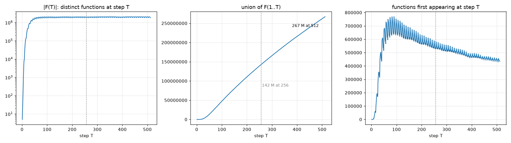

# exp10: the clock extended to 512 steps, champion ISA SWAP,ADD,NAND,SKZ

Steps 257..512 were swept for all 4,294,967,296 programs on knecht24 (kernel and driver of exp09, `MAX_STEPS` 512; validation of the new
steps against the Python reference in `exp09_validation.md`). Ranking by `fast/exp10_rank.py`; data `results/exp09/w4_o2_add/union_1-512.npy`.

## Growth

| | functions |
|---|---:|
| union over T = 1..256 (exp09) | 142,263,973 |
| union over T = 1..512 | 267,132,154 |
| new beyond step 256 | 124,868,181 (46.7 % of the union) |
| at step 512 alone | 1,843,694 (step 256: 1,829,051) |
| richest single step | T = 355 with 2,095,387 |
| new per step, 257..320 / 321..384 / 385..448 / 449..512 | 33,927,069 / 31,998,038 / 30,094,387 / 28,848,687 |

## Persistence (at how many of the 512 steps a function occurs)

| | first seen at T <= 256 | first seen at T > 256 |
|---|---:|---:|
| functions | 142,263,973 | 124,868,181 |
| at one step only | 37.9 % | 48.0 % |
| median steps | 2 | 2 |
| at 64 or more steps | 1,130,408 | 1,443 |
| at 256 or more steps | 183,923 | 0 |

## What the new functions are

| class | first seen at T <= 256 | first seen at T > 256 |
|---|---:|---:|
| constants | 16 (0.0 %) | 0 (0.0 %) |
| bijections | 49,935 (0.0 %) | 6,645 (0.0 %) |
| involutions | 3,291 (0.0 %) | 396 (0.0 %) |
| idempotent | 850,709 (0.6 %) | 412,218 (0.3 %) |
| depend on all 4 input bits | 134,849,901 (94.8 %) | 120,963,692 (96.9 %) |

image size (distinct outputs) histogram, old vs new: 1: 16/0, 2: 339,060/56,499, 3: 3,512,336/1,117,987, 4: 10,866,084/4,975,310, 5: 14,968,489/9,120,108, 6: 18,712,586/13,543,525, 7: 19,415,659/16,456,398, 8: 20,096,294/19,248,127, 9: 17,628,136/20,355,419, 10: 14,131,948/18,322,423, 11: 9,759,971/12,290,089, 12: 6,436,935/6,113,990, 13: 3,868,820/2,352,394, 14: 1,973,973/760,879, 15: 503,731/148,388, 16: 49,935/6,645

## Named functions

341 of the catalog's named tables occur somewhere in T = 1..512; 2 of them only beyond step 256:

- less_than_10 (`1 if x<10 else 0 (unsigned)`): minimal T 409, at 5 steps, program `0x1636283c`
- shift_right_1 (`x >> 1 (unsigned)`): minimal T 352, at 4 steps, program `0x5182381c`

## Top 40 new functions by persistence

| key (table x=0..15) | min T | steps present | program | disassembly | names |
|---|---:|---:|---|---|---|
| `4b6d464bcb9787cb` | 267 | 209 | `0xc1a0b523` | `SWAP 3; SWAP 2; ADD 1; NAND 3; SWAP 0; NAND 2; SWAP 1; SKZ 0` | - |
| `ff0ff0ff00f00fff` | 269 | 201 | `0xc509c912` | `SWAP 2; SWAP 1; NAND 1; SKZ 0; NAND 1; SWAP 0; ADD 1; SKZ 0` | - |
| `050f00f5fff55f50` | 281 | 194 | `0xc55585c1` | `SWAP 1; SKZ 0; ADD 1; NAND 0; ADD 1; ADD 1; ADD 1; SKZ 0` | - |
| `000a00a0aaa00a00` | 282 | 193 | `0xc55585c1` | `SWAP 1; SKZ 0; ADD 1; NAND 0; ADD 1; ADD 1; ADD 1; SKZ 0` | - |
| `ee0e0e0e0e0efeef` | 259 | 192 | `0xc10642a3` | `SWAP 3; NAND 2; SWAP 2; ADD 0; ADD 2; SWAP 0; SWAP 1; SKZ 0` | - |
| `eeefefefefeffeef` | 268 | 185 | `0xc01642a3` | `SWAP 3; NAND 2; SWAP 2; ADD 0; ADD 2; SWAP 1; SWAP 0; SKZ 0` | - |
| `0f0f00f00000f000` | 267 | 174 | `0x5a2291c2` | `SWAP 2; SKZ 0; SWAP 1; NAND 1; SWAP 2; SWAP 2; NAND 2; ADD 1` | - |
| `ffe0e0e0e0e0effe` | 283 | 174 | `0xc10642a3` | `SWAP 3; NAND 2; SWAP 2; ADD 0; ADD 2; SWAP 0; SWAP 1; SKZ 0` | - |
| `0f0000f0ffff00ff` | 273 | 172 | `0x506c9c21` | `SWAP 1; SWAP 2; SKZ 0; NAND 1; SKZ 0; ADD 2; SWAP 0; ADD 1` | - |
| `ff0ff000fff000ff` | 274 | 171 | `0xc016ac82` | `SWAP 2; NAND 0; SKZ 0; NAND 2; ADD 2; SWAP 1; SWAP 0; SKZ 0` | - |
| `4b6d49b43b687834` | 260 | 170 | `0x10ab523c` | `SKZ 0; SWAP 3; SWAP 2; ADD 1; NAND 3; NAND 2; SWAP 0; SWAP 1` | - |
| `00f00f00ff0ff000` | 277 | 170 | `0xc160aca2` | `SWAP 2; NAND 2; SKZ 0; NAND 2; SWAP 0; ADD 2; SWAP 1; SKZ 0` | - |
| `00ffff0f00f0ff00` | 277 | 170 | `0x506c9c21` | `SWAP 1; SWAP 2; SKZ 0; NAND 1; SKZ 0; ADD 2; SWAP 0; ADD 1` | - |
| `00f00ffff0f0f000` | 260 | 169 | `0x96c81332` | `SWAP 2; SWAP 3; SWAP 3; SWAP 1; NAND 0; SKZ 0; ADD 2; NAND 1` | - |
| `ff0ff00f0fff0f0f` | 268 | 169 | `0xc159c283` | `SWAP 3; NAND 0; SWAP 2; SKZ 0; NAND 1; ADD 1; SWAP 1; SKZ 0` | - |
| `727a72fa727a7272` | 259 | 168 | `0x52531ba2` | `SWAP 2; NAND 2; NAND 3; SWAP 1; SWAP 3; ADD 1; SWAP 2; ADD 1` | - |
| `b492b64bc49787cb` | 268 | 165 | `0x10ab523c` | `SKZ 0; SWAP 3; SWAP 2; ADD 1; NAND 3; NAND 2; SWAP 0; SWAP 1` | - |
| `0a00000a000aa0a0` | 281 | 156 | `0x55585c1c` | `SKZ 0; SWAP 1; SKZ 0; ADD 1; NAND 0; ADD 1; ADD 1; ADD 1` | - |
| `ff00000f00000100` | 266 | 155 | `0x515c912c` | `SKZ 0; SWAP 2; SWAP 1; NAND 1; SKZ 0; ADD 1; SWAP 1; ADD 1` | - |
| `f0f5ff505550050f` | 284 | 153 | `0x55585c1c` | `SKZ 0; SWAP 1; SKZ 0; ADD 1; NAND 0; ADD 1; ADD 1; ADD 1` | - |
| `5f50550f000ff0f5` | 286 | 152 | `0x55585c1c` | `SKZ 0; SWAP 1; SKZ 0; ADD 1; NAND 0; ADD 1; ADD 1; ADD 1` | - |
| `000f0f00f00f0ff0` | 301 | 152 | `0xc165a732` | `SWAP 2; SWAP 3; ADD 3; NAND 2; ADD 1; ADD 2; SWAP 1; SKZ 0` | - |
| `100f77fe77000701` | 301 | 152 | `0x55c6a521` | `SWAP 1; SWAP 2; ADD 1; NAND 2; ADD 2; SKZ 0; ADD 1; ADD 1` | - |
| `0a00a05005005005` | 287 | 150 | `0x5c218413` | `SWAP 3; SWAP 1; ADD 0; NAND 0; SWAP 1; SWAP 2; SKZ 0; ADD 1` | - |
| `0f00fff0ffff000f` | 336 | 149 | `0x125c8182` | `SWAP 2; NAND 0; SWAP 1; NAND 0; SKZ 0; ADD 1; SWAP 2; SWAP 1` | - |
| `0550f5f05a5faaf0` | 257 | 148 | `0xc55151c8` | `NAND 0; SKZ 0; SWAP 1; ADD 1; SWAP 1; ADD 1; ADD 1; SKZ 0` | - |
| `0f00f0f000fff0f0` | 298 | 148 | `0x505c9c21` | `SWAP 1; SWAP 2; SKZ 0; NAND 1; SKZ 0; ADD 1; SWAP 0; ADD 1` | - |
| `00100f100100100f` | 257 | 147 | `0xc016bc62` | `SWAP 2; ADD 2; SKZ 0; NAND 3; ADD 2; SWAP 1; SWAP 0; SKZ 0` | - |
| `9494985494949854` | 302 | 146 | `0x186b7328` | `NAND 0; SWAP 2; SWAP 3; ADD 3; NAND 3; ADD 2; NAND 0; SWAP 1` | - |
| `00f10f100100f10f` | 258 | 145 | `0xc160bc62` | `SWAP 2; ADD 2; SKZ 0; NAND 3; SWAP 0; ADD 2; SWAP 1; SKZ 0` | - |
| `000100f10f100100` | 259 | 145 | `0xc016bc62` | `SWAP 2; ADD 2; SKZ 0; NAND 3; ADD 2; SWAP 1; SWAP 0; SKZ 0` | - |
| `0f00fff000fff0ff` | 298 | 145 | `0x055c9c21` | `SWAP 1; SWAP 2; SKZ 0; NAND 1; SKZ 0; ADD 1; ADD 1; SWAP 0` | - |
| `00f0fff0f0fff00f` | 339 | 145 | `0x125c8182` | `SWAP 2; NAND 0; SWAP 1; NAND 0; SKZ 0; ADD 1; SWAP 2; SWAP 1` | - |
| `00f100f10f10f100` | 259 | 144 | `0xc160bc62` | `SWAP 2; ADD 2; SKZ 0; NAND 3; SWAP 0; ADD 2; SWAP 1; SKZ 0` | - |
| `000f100100100f10` | 260 | 144 | `0xc016bc62` | `SWAP 2; ADD 2; SKZ 0; NAND 3; ADD 2; SWAP 1; SWAP 0; SKZ 0` | - |
| `0ff0fff0f00ff00f` | 258 | 143 | `0x51c926a1` | `SWAP 1; NAND 2; ADD 2; SWAP 2; NAND 1; SKZ 0; SWAP 1; ADD 1` | - |
| `000f10f10f100f10` | 260 | 143 | `0xc160bc62` | `SWAP 2; ADD 2; SKZ 0; NAND 3; SWAP 0; ADD 2; SWAP 1; SKZ 0` | - |
| `0100100f10f10010` | 261 | 143 | `0xc016bc62` | `SWAP 2; ADD 2; SKZ 0; NAND 3; ADD 2; SWAP 1; SWAP 0; SKZ 0` | - |
| `0100f100100100f1` | 262 | 143 | `0xc016bc62` | `SWAP 2; ADD 2; SKZ 0; NAND 3; ADD 2; SWAP 1; SWAP 0; SKZ 0` | - |
| `ff58f70071c0f88f` | 265 | 143 | `0xc56a5261` | `SWAP 1; ADD 2; SWAP 2; ADD 1; NAND 2; ADD 2; ADD 1; SKZ 0` | - |

## Does the library ever stop growing?

New functions per step fall slowly after a peak of about 760,000 near step 90: 570,000 per step around 256, 450,000 at 512. The decline is
roughly linear at about 100,000 fewer per step every 128 steps, so a straight-line extrapolation reaches zero near step 1,100 and a total library of
roughly 400 million functions for this ISA. The functions added late are the least persistent (48 % exist at a single step, none at 256 or more),
and only two catalog names (`x >> 1` at step 352 and `x < 10` at step 409) first appear beyond 256, so the practical value of the clock beyond 512
is low: a 512-step clock already holds every named function this ISA realises and the persistent core (184 k functions present at 256 or more steps).
Cost: steps 257..512 took 30 min of GPU time on the three RTX 3060 (passes of 6-9 min, each simulating up to 512 steps) plus 13 min of merging.

## Using them

- A function is addressed by (program, T): run the program for exactly its minimal T steps (`sim/machine.py` `run(max_steps=T)`,
  `u1map` `run_budget`, the Life engines `--max-steps`). The union file gives (key, minT, program, persistence) for every function.
- The Life engines (CUDA and Rust reference) now take `--max-steps`; a world with `--max-steps 512` draws its phenotypes from the 512-step
  library, at a step cost of up to 32 per tick instead of 16. The Vulkan engine does not have the option yet.
- The ranking columns to pick functions for a world or a translation: persistence (robust to the clock), minimal T (cost), class, name.
