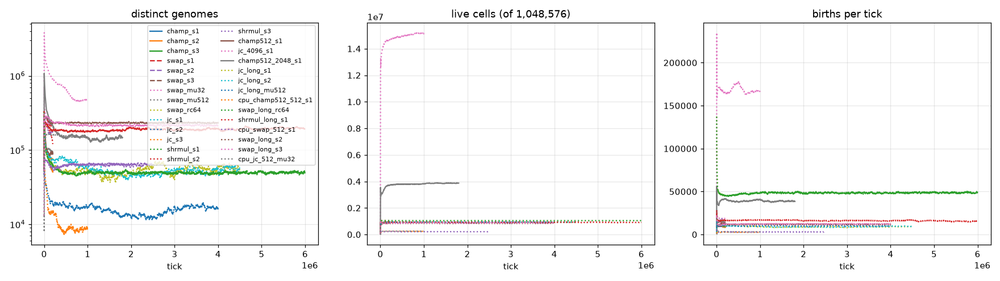
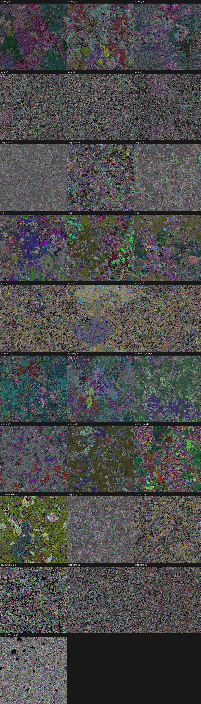

# Life ensemble: analysis of the nine 1024^2 x 200,000-tick runs

Source commit of the engines: `eed02f8` (CUDA on adler40/knecht24, Vulkan on specht32/falke64, verified bit-identical to the
CPU reference on all nine GPUs before the run). Configuration: `cluster/life_runs.conf`; dispatch: `cluster/run_life.py`;
this report: `cluster/analyze_life.py`. Phenotypes below use the Python reference machine on the dumped final grids.

## Runs, speed, survival

| run | ISA | seed | mu_bits | repro_cost | income | steps | GPU | GPU s | ticks/s | M cell-updates/s | final alive | min alive (t>=1000) | extinct |
|---|---|---:|---:|---:|---:|---:|---|---:|---:|---:|---:|---:|---|
| champ_s1 | SWAP,ADD,NAND,SKZ | 1 | 128 | 128 | 20 | 256 | adler40 RTX 4090 | 500 | 400 | 419 | 882,215 (84.1%) | 311,933 | no |
| champ_s2 | SWAP,ADD,NAND,SKZ | 2 | 128 | 128 | 20 | 256 | adler40 RTX 4080 | 530 | 377 | 395 | 900,669 (85.9%) | 312,129 | no |
| champ_s3 | SWAP,ADD,NAND,SKZ | 3 | 128 | 128 | 20 | 256 | knecht24 RTX 3060 #0 | 1499 | 133 | 140 | 952,442 (90.8%) | 305,170 | no |
| swap_s1 | SWAP,LDI,NAND,ADD,ROL,SKNZ,INC,HALT | 1 | 128 | 128 | 8 | 256 | knecht24 RTX 3060 #1 | 179 | 1117 | 1172 | 869,286 (82.9%) | 835,894 | no |
| swap_s2 | SWAP,LDI,NAND,ADD,ROL,SKNZ,INC,HALT | 2 | 128 | 128 | 8 | 256 | knecht24 RTX 3060 #2 | 174 | 1153 | 1209 | 859,658 (82.0%) | 831,548 | no |
| swap_s3 | SWAP,LDI,NAND,ADD,ROL,SKNZ,INC,HALT | 3 | 128 | 128 | 8 | 256 | specht32 RX 9070 XT | 1738 | 115 | 121 | 855,590 (81.6%) | 820,895 | no |
| swap_mu32 | SWAP,LDI,NAND,ADD,ROL,SKNZ,INC,HALT | 1 | 32 | 128 | 8 | 256 | specht32 RX 9060 XT | 1700 | 118 | 123 | 1,039,320 (99.1%) | 1,016,041 | no |
| swap_mu512 | SWAP,LDI,NAND,ADD,ROL,SKNZ,INC,HALT | 1 | 512 | 128 | 8 | 256 | falke64 R9700 #0 | 996 | 201 | 211 | 884,981 (84.4%) | 791,731 | no |
| swap_rc64 | SWAP,LDI,NAND,ADD,ROL,SKNZ,INC,HALT | 1 | 128 | 64 | 8 | 256 | falke64 R9700 #1 | 444 | 451 | 473 | 1,046,089 (99.8%) | 1,043,366 | no |
| jc_s1 | SWAP,ADD,NAND,JC | 1 | 128 | 128 | 20 | 256 | adler40 RTX 4090 | 494 | 405 | 425 | 916,979 (87.4%) | 215,352 | no |
| jc_s2 | SWAP,ADD,NAND,JC | 2 | 128 | 128 | 20 | 256 | adler40 RTX 4080 | 531 | 377 | 395 | 928,638 (88.6%) | 194,467 | no |
| jc_s3 | SWAP,ADD,NAND,JC | 3 | 128 | 128 | 20 | 256 | knecht24 RTX 3060 #2 | 1590 | 126 | 132 | 920,488 (87.8%) | 205,080 | no |
| shrmul_s1 | SWAP,ADD,NAND,XOR,SHR,MUL,SKZ,HALT | 1 | 128 | 128 | 8 | 256 | falke64 R9700 #0 | 1244 | 161 | 169 | 925,152 (88.2%) | 868,349 | no |
| shrmul_s2 | SWAP,ADD,NAND,XOR,SHR,MUL,SKZ,HALT | 2 | 128 | 128 | 8 | 256 | falke64 R9700 #1 | 849 | 236 | 247 | 967,574 (92.3%) | 863,156 | no |
| shrmul_s3 | SWAP,ADD,NAND,XOR,SHR,MUL,SKZ,HALT | 3 | 128 | 128 | 8 | 256 | specht32 RX 9070 XT | 1579 | 127 | 133 | 932,602 (88.9%) | 857,648 | no |
| champ512_s1 | SWAP,ADD,NAND,SKZ | 1 | 128 | 128 | 36 | 512 | adler40 RTX 4080 | 1017 | 197 | 206 | 916,394 (87.4%) | 314,234 | no |
| jc_4096_s1 | SWAP,ADD,NAND,JC | 1 | 128 | 128 | 20 | 256 | adler40 RTX 4090 | 37083 | 27 | 452 | 15,146,860 (90.3%) | 3,258,501 | no |
| champ512_2048_s1 | SWAP,ADD,NAND,SKZ | 1 | 128 | 128 | 36 | 512 | adler40 RTX 4080 | 35120 | 51 | 215 | 3,877,054 (92.4%) | 1,242,528 | no |
| jc_long_s1 | SWAP,ADD,NAND,JC | 1 | 128 | 128 | 20 | 256 | knecht24 RTX 3060 #0 | 32958 | 137 | 143 | 929,257 (88.6%) | 215,352 | no |
| jc_long_s2 | SWAP,ADD,NAND,JC | 2 | 128 | 128 | 20 | 256 | knecht24 RTX 3060 #1 | 35118 | 128 | 134 | 934,213 (89.1%) | 194,467 | no |
| jc_long_mu512 | SWAP,ADD,NAND,JC | 1 | 512 | 128 | 20 | 256 | knecht24 RTX 3060 #2 | 32021 | 125 | 131 | 913,431 (87.1%) | 342,375 | no |
| cpu_champ512_512_s1 | SWAP,ADD,NAND,SKZ | 1 | 128 | 128 | 36 | 512 | knecht24 CPU | 49630 | 20 | 5 | 238,612 (91.0%) | 75,773 | no |
| swap_long_rc64 | SWAP,LDI,NAND,ADD,ROL,SKNZ,INC,HALT | 1 | 128 | 64 | 8 | 256 | falke64 R9700 #1 | 25154 | 239 | 250 | 1,046,058 (99.8%) | 1,043,366 | no |
| shrmul_long_s1 | SWAP,ADD,NAND,XOR,SHR,MUL,SKZ,HALT | 1 | 128 | 128 | 8 | 256 | falke64 R9700 #1 | 15202 | 395 | 414 | 909,254 (86.7%) | 868,349 | no |
| cpu_swap_512_s1 | SWAP,LDI,NAND,ADD,ROL,SKNZ,INC,HALT | 1 | 128 | 128 | 8 | 256 | falke64 CPU | 23154 | 108 | 28 | 217,536 (83.0%) | 205,116 | no |
| swap_long_s2 | SWAP,LDI,NAND,ADD,ROL,SKNZ,INC,HALT | 2 | 128 | 128 | 8 | 256 | specht32 RX 9070 XT | 29508 | 136 | 142 | 843,736 (80.5%) | 831,548 | no |
| swap_long_s3 | SWAP,LDI,NAND,ADD,ROL,SKNZ,INC,HALT | 3 | 128 | 128 | 8 | 256 | specht32 RX 9060 XT | 26056 | 154 | 161 | 862,490 (82.3%) | 820,895 | no |
| cpu_jc_512_mu32 | SWAP,ADD,NAND,JC | 1 | 32 | 128 | 20 | 256 | specht32 CPU | 31742 | 32 | 8 | 252,495 (96.3%) | 8,824 | no |

GPU seconds are the engine's own `done ... ticks in ...s`; the dispatcher wall time in RUNS.md adds the copy-back.

## Genome diversity (distinct genomes among live cells)

| run | t=0 (initial) | 1,000 | 10,000 | 50,000 | 100,000 | 200,000 | max after 1,000 | min after 1,000 | births/tick at end | mean energy at end |
|---|---:|---:|---:|---:|---:|---:|---:|---:|---:|---:|
| champ_s1 | 52,579 | 137,122 | 197,059 | 107,129 | 82,074 | 51,219 | 271,221 | 51,219 | 8,609 | 186.7 |
| champ_s2 | 52,104 | 136,972 | 198,252 | 96,303 | 77,726 | 50,923 | 268,489 | 50,923 | 8,550 | 189.7 |
| champ_s3 | 52,687 | 134,435 | 184,353 | 102,730 | 75,936 | 58,444 | 267,697 | 58,052 | 9,526 | 186.4 |
| swap_s1 | 52,579 | 299,252 | 234,736 | 274,103 | 231,916 | 224,903 | 299,252 | 181,802 | 12,615 | 208.2 |
| swap_s2 | 52,104 | 296,208 | 223,035 | 276,923 | 239,543 | 232,652 | 296,208 | 175,429 | 12,021 | 209.5 |
| swap_s3 | 52,687 | 298,263 | 236,709 | 280,447 | 272,551 | 238,780 | 298,263 | 187,204 | 11,841 | 210.6 |
| swap_mu32 | 52,579 | 717,907 | 370,772 | 272,681 | 223,535 | 229,298 | 717,907 | 218,010 | 18,739 | 198.8 |
| swap_mu512 | 52,579 | 95,433 | 70,997 | 98,961 | 103,858 | 93,516 | 105,374 | 53,784 | 14,657 | 202.4 |
| swap_rc64 | 52,579 | 324,911 | 183,627 | 92,456 | 74,605 | 62,614 | 324,911 | 61,556 | 44,999 | 198.4 |
| jc_s1 | 52,579 | 92,695 | 163,068 | 90,733 | 76,158 | 63,826 | 236,784 | 63,826 | 10,029 | 184.8 |
| jc_s2 | 52,104 | 84,056 | 161,396 | 103,362 | 83,580 | 71,090 | 242,090 | 70,891 | 10,700 | 180.9 |
| jc_s3 | 52,687 | 86,954 | 167,361 | 109,053 | 91,997 | 75,476 | 239,540 | 72,637 | 10,084 | 182.5 |
| shrmul_s1 | 52,579 | 327,843 | 178,299 | 227,572 | 208,009 | 181,616 | 327,843 | 174,300 | 16,474 | 198.8 |
| shrmul_s2 | 52,104 | 329,930 | 175,372 | 218,350 | 196,917 | 123,640 | 329,930 | 122,332 | 17,595 | 199.3 |
| shrmul_s3 | 52,687 | 328,050 | 175,057 | 227,549 | 175,835 | 176,261 | 328,050 | 158,888 | 16,196 | 200.1 |
| champ512_s1 | 52,579 | 134,923 | 202,527 | 104,466 | 90,497 | 89,144 | 273,500 | 82,974 | 10,251 | 172.7 |
| jc_4096_s1 | 838,503 | 1,397,379 | 2,555,008 | 1,465,663 | 1,149,806 | 902,578 | 3,796,670 | 450,359 | 165,898 | 184.4 |
| champ512_2048_s1 | 209,843 | 535,538 | 780,519 | 356,722 | 281,436 | 210,544 | 1,078,965 | 127,864 | 38,504 | 177.9 |
| jc_long_s1 | 52,579 | 92,695 | 163,068 | 90,733 | 76,158 | 63,826 | 236,784 | 36,273 | 9,257 | 187.5 |
| jc_long_s2 | 52,104 | 84,056 | 161,396 | 103,362 | 83,580 | 71,090 | 242,090 | 39,283 | 9,290 | 185.8 |
| jc_long_mu512 | 52,579 | 44,621 | 45,793 | 32,621 | 24,078 | 18,665 | 83,331 | 11,553 | 9,979 | 182.8 |
| cpu_champ512_512_s1 | 13,141 | 33,120 | 51,780 | 31,802 | 15,596 | 14,540 | 67,838 | 7,316 | 2,518 | 174.6 |
| swap_long_rc64 | 52,579 | 324,911 | 183,627 | 92,456 | 74,605 | 62,614 | 324,911 | 44,421 | 48,788 | 194.2 |
| shrmul_long_s1 | 52,579 | 327,843 | 178,299 | 227,572 | 208,009 | 181,616 | 327,843 | 172,148 | 15,520 | 200.4 |
| cpu_swap_512_s1 | 13,141 | 73,634 | 59,019 | 72,922 | 65,257 | 57,743 | 73,814 | 46,030 | 2,888 | 210.1 |
| swap_long_s2 | 52,104 | 296,208 | 223,035 | 276,923 | 239,543 | 232,652 | 296,208 | 175,429 | 11,472 | 211.4 |
| swap_long_s3 | 52,687 | 298,263 | 236,709 | 280,447 | 272,551 | 238,780 | 298,263 | 187,204 | 11,977 | 209.5 |
| cpu_jc_512_mu32 | 13,141 | 7,900 | 83,424 | 159,856 | 164,472 | 161,012 | 164,584 | 7,900 | 2,984 | 186.8 |

## Final populations: most common genomes

Each run's 100 most abundant genomes were executed on all 256 (state, neighbour state) inputs. `trigger` is the fraction of inputs
whose new state is 15 (reproduction); `nb-dep` is how many of the 16 own states give a neighbour-dependent outcome; `halt` is the
fraction of inputs that reach HALT (the champion ISA has none, so every genome costs the full budget: cost 16 at 256 steps, 32 at 512).

| run | genome | share | trigger | nb-dep states | halt | mean steps | mean cost | program |
|---|---|---:|---:|---:|---:|---:|---:|---|
| champ_s1 | `0x02a49326` | 10.1% | 0.44 | 16 | 0.00 | 256 | 16.0 | `ADD 2; SWAP 2; SWAP 3; NAND 1; ADD 0; NAND 2; SWAP 2; SWAP 0` |
| champ_s1 | `0x92530541` | 8.3% | 0.48 | 7 | 0.00 | 256 | 16.0 | `SWAP 1; ADD 0; ADD 1; SWAP 0; SWAP 3; ADD 1; SWAP 2; NAND 1` |
| champ_s1 | `0x320b4936` | 6.0% | 0.44 | 16 | 0.00 | 256 | 16.0 | `ADD 2; SWAP 3; NAND 1; ADD 0; NAND 3; SWAP 0; SWAP 2; SWAP 3` |
| champ_s2 | `0x2a490326` | 6.0% | 0.44 | 16 | 0.00 | 256 | 16.0 | `ADD 2; SWAP 2; SWAP 3; SWAP 0; NAND 1; ADD 0; NAND 2; SWAP 2` |
| champ_s2 | `0x2a493026` | 1.6% | 0.44 | 16 | 0.00 | 256 | 16.0 | `ADD 2; SWAP 2; SWAP 0; SWAP 3; NAND 1; ADD 0; NAND 2; SWAP 2` |
| champ_s2 | `0xb1425360` | 1.4% | 0.39 | 13 | 0.00 | 256 | 16.0 | `SWAP 0; ADD 2; SWAP 3; ADD 1; SWAP 2; ADD 0; SWAP 1; NAND 3` |
| champ_s3 | `0x6a49237d` | 5.3% | 0.05 | 8 | 0.00 | 256 | 16.0 | `SKZ 1; ADD 3; SWAP 3; SWAP 2; NAND 1; ADD 0; NAND 2; ADD 2` |
| champ_s3 | `0x6a49237f` | 5.1% | 0.05 | 8 | 0.00 | 256 | 16.0 | `SKZ 3; ADD 3; SWAP 3; SWAP 2; NAND 1; ADD 0; NAND 2; ADD 2` |
| champ_s3 | `0x6a49237c` | 4.8% | 0.05 | 8 | 0.00 | 256 | 16.0 | `SKZ 0; ADD 3; SWAP 3; SWAP 2; NAND 1; ADD 0; NAND 2; ADD 2` |
| swap_s1 | `0xf0765913` | 0.7% | 0.50 | 16 | 1.00 | 8 | 1.0 | `LDI 1; SWAP 1; ROL 1; NAND 1; ADD 0; ADD 1; SWAP 0; HALT 1` |
| swap_s1 | `0xf0765813` | 0.7% | 0.50 | 16 | 1.00 | 8 | 1.0 | `LDI 1; SWAP 1; ROL 0; NAND 1; ADD 0; ADD 1; SWAP 0; HALT 1` |
| swap_s1 | `0xe0765913` | 0.7% | 0.50 | 16 | 1.00 | 8 | 1.0 | `LDI 1; SWAP 1; ROL 1; NAND 1; ADD 0; ADD 1; SWAP 0; HALT 0` |
| swap_s2 | `0x2f765913` | 0.2% | 0.50 | 16 | 1.00 | 7 | 1.0 | `LDI 1; SWAP 1; ROL 1; NAND 1; ADD 0; ADD 1; HALT 1; LDI 0` |
| swap_s2 | `0xced65777` | 0.2% | 0.42 | 16 | 1.00 | 7 | 1.0 | `ADD 1; ADD 1; ADD 1; NAND 1; ADD 0; INC 1; HALT 0; INC 0` |
| swap_s2 | `0x8f765913` | 0.2% | 0.50 | 16 | 1.00 | 7 | 1.0 | `LDI 1; SWAP 1; ROL 1; NAND 1; ADD 0; ADD 1; HALT 1; ROL 0` |
| swap_s3 | `0xec657770` | 2.2% | 0.42 | 16 | 1.00 | 8 | 1.0 | `SWAP 0; ADD 1; ADD 1; ADD 1; NAND 1; ADD 0; INC 0; HALT 0` |
| swap_s3 | `0xfc657770` | 2.1% | 0.42 | 16 | 1.00 | 8 | 1.0 | `SWAP 0; ADD 1; ADD 1; ADD 1; NAND 1; ADD 0; INC 0; HALT 1` |
| swap_s3 | `0xfd657770` | 2.0% | 0.42 | 16 | 1.00 | 8 | 1.0 | `SWAP 0; ADD 1; ADD 1; ADD 1; NAND 1; ADD 0; INC 1; HALT 1` |
| swap_mu32 | `0xce8859c3` | 0.0% | 0.50 | 16 | 1.00 | 7 | 1.0 | `LDI 1; INC 0; ROL 1; NAND 1; ROL 0; ROL 0; HALT 0; INC 0` |
| swap_mu32 | `0x5f8859c3` | 0.0% | 0.50 | 16 | 1.00 | 7 | 1.0 | `LDI 1; INC 0; ROL 1; NAND 1; ROL 0; ROL 0; HALT 1; NAND 1` |
| swap_mu32 | `0xbf8859c3` | 0.0% | 0.50 | 16 | 1.00 | 7 | 1.0 | `LDI 1; INC 0; ROL 1; NAND 1; ROL 0; ROL 0; HALT 1; SKNZ 1` |
| swap_mu512 | `0xe51695b4` | 0.3% | 0.37 | 15 | 1.00 | 7 | 1.0 | `NAND 0; SKNZ 1; NAND 1; ROL 1; ADD 0; SWAP 1; NAND 1; HALT 0` |
| swap_mu512 | `0xf5685b40` | 0.3% | 0.37 | 15 | 1.00 | 7 | 1.0 | `SWAP 0; NAND 0; SKNZ 1; NAND 1; ROL 0; ADD 0; NAND 1; HALT 1` |
| swap_mu512 | `0xed605777` | 0.2% | 0.42 | 16 | 1.00 | 8 | 1.0 | `ADD 1; ADD 1; ADD 1; NAND 1; SWAP 0; ADD 0; INC 1; HALT 0` |
| swap_rc64 | `0xe9859c37` | 0.3% | 0.50 | 16 | 1.00 | 8 | 1.0 | `ADD 1; LDI 1; INC 0; ROL 1; NAND 1; ROL 0; ROL 1; HALT 0` |
| swap_rc64 | `0xe9859d37` | 0.2% | 0.50 | 16 | 1.00 | 8 | 1.0 | `ADD 1; LDI 1; INC 1; ROL 1; NAND 1; ROL 0; ROL 1; HALT 0` |
| swap_rc64 | `0xe8859c37` | 0.2% | 0.50 | 16 | 1.00 | 8 | 1.0 | `ADD 1; LDI 1; INC 0; ROL 1; NAND 1; ROL 0; ROL 0; HALT 0` |
| jc_s1 | `0x23a492e7` | 10.5% | 0.44 | 16 | 0.00 | 256 | 16.0 | `ADD 3; JC 2; SWAP 2; NAND 1; ADD 0; NAND 2; SWAP 3; SWAP 2` |
| jc_s1 | `0x023a4927` | 9.4% | 0.44 | 16 | 0.00 | 256 | 16.0 | `ADD 3; SWAP 2; NAND 1; ADD 0; NAND 2; SWAP 3; SWAP 2; SWAP 0` |
| jc_s1 | `0x45441d28` | 2.9% | 0.28 | 16 | 0.00 | 256 | 16.0 | `NAND 0; SWAP 2; JC 1; SWAP 1; ADD 0; ADD 0; ADD 1; ADD 0` |
| jc_s2 | `0x32b4936d` | 12.1% | 0.44 | 16 | 0.00 | 256 | 16.0 | `JC 1; ADD 2; SWAP 3; NAND 1; ADD 0; NAND 3; SWAP 2; SWAP 3` |
| jc_s2 | `0x2a493206` | 5.2% | 0.44 | 16 | 0.00 | 256 | 16.0 | `ADD 2; SWAP 0; SWAP 2; SWAP 3; NAND 1; ADD 0; NAND 2; SWAP 2` |
| jc_s2 | `0xb6a49273` | 4.0% | 0.41 | 16 | 0.00 | 256 | 16.0 | `SWAP 3; ADD 3; SWAP 2; NAND 1; ADD 0; NAND 2; ADD 2; NAND 3` |
| jc_s3 | `0x2a493260` | 11.7% | 0.44 | 16 | 0.00 | 256 | 16.0 | `SWAP 0; ADD 2; SWAP 2; SWAP 3; NAND 1; ADD 0; NAND 2; SWAP 2` |
| jc_s3 | `0x02a49326` | 3.7% | 0.44 | 16 | 0.00 | 256 | 16.0 | `ADD 2; SWAP 2; SWAP 3; NAND 1; ADD 0; NAND 2; SWAP 2; SWAP 0` |
| jc_s3 | `0x17b2b366` | 3.5% | 0.41 | 6 | 0.00 | 256 | 16.0 | `ADD 2; ADD 2; SWAP 3; NAND 3; SWAP 2; NAND 3; ADD 3; SWAP 1` |
| shrmul_s1 | `0xe5918a93` | 2.1% | 0.75 | 15 | 1.00 | 8 | 1.0 | `ADD 1; SHR 1; MUL 0; SHR 0; SWAP 1; SHR 1; NAND 1; HALT 0` |
| shrmul_s1 | `0xe5919a93` | 1.8% | 0.75 | 15 | 1.00 | 8 | 1.0 | `ADD 1; SHR 1; MUL 0; SHR 1; SWAP 1; SHR 1; NAND 1; HALT 0` |
| shrmul_s1 | `0xf5918a83` | 1.8% | 0.75 | 15 | 1.00 | 8 | 1.0 | `ADD 1; SHR 0; MUL 0; SHR 0; SWAP 1; SHR 1; NAND 1; HALT 1` |
| shrmul_s2 | `0xf52214c5` | 5.4% | 0.77 | 12 | 1.00 | 8 | 1.0 | `NAND 1; SKZ 0; NAND 0; SWAP 1; ADD 0; ADD 0; NAND 1; HALT 1` |
| shrmul_s2 | `0xe52214c5` | 5.1% | 0.77 | 12 | 1.00 | 8 | 1.0 | `NAND 1; SKZ 0; NAND 0; SWAP 1; ADD 0; ADD 0; NAND 1; HALT 0` |
| shrmul_s2 | `0xf52214d5` | 3.8% | 0.77 | 12 | 1.00 | 8 | 1.0 | `NAND 1; SKZ 1; NAND 0; SWAP 1; ADD 0; ADD 0; NAND 1; HALT 1` |
| shrmul_s3 | `0xe5918a93` | 2.0% | 0.75 | 15 | 1.00 | 8 | 1.0 | `ADD 1; SHR 1; MUL 0; SHR 0; SWAP 1; SHR 1; NAND 1; HALT 0` |
| shrmul_s3 | `0xf5918a93` | 1.9% | 0.75 | 15 | 1.00 | 8 | 1.0 | `ADD 1; SHR 1; MUL 0; SHR 0; SWAP 1; SHR 1; NAND 1; HALT 1` |
| shrmul_s3 | `0xe5918a83` | 1.9% | 0.75 | 15 | 1.00 | 8 | 1.0 | `ADD 1; SHR 0; MUL 0; SHR 0; SWAP 1; SHR 1; NAND 1; HALT 0` |
| champ512_s1 | `0x6a375582` | 20.0% | 0.38 | 15 | 0.00 | 512 | 32.0 | `SWAP 2; NAND 0; ADD 1; ADD 1; ADD 3; SWAP 3; NAND 2; ADD 2` |
| champ512_s1 | `0x6a357582` | 11.7% | 0.38 | 15 | 0.00 | 512 | 32.0 | `SWAP 2; NAND 0; ADD 1; ADD 3; ADD 1; SWAP 3; NAND 2; ADD 2` |
| champ512_s1 | `0xb7377755` | 1.5% | 0.24 | 16 | 0.00 | 512 | 32.0 | `ADD 1; ADD 1; ADD 3; ADD 3; ADD 3; SWAP 3; ADD 3; NAND 3` |
| jc_4096_s1 | `0x74e493e1` | 7.1% | 0.22 | 5 | 0.00 | 256 | 16.0 | `SWAP 1; JC 2; SWAP 3; NAND 1; ADD 0; JC 2; ADD 0; ADD 3` |
| jc_4096_s1 | `0x3b4923e7` | 5.1% | 0.44 | 16 | 0.00 | 256 | 16.0 | `ADD 3; JC 2; SWAP 3; SWAP 2; NAND 1; ADD 0; NAND 3; SWAP 3` |
| jc_4096_s1 | `0x74e49361` | 3.8% | 0.22 | 5 | 0.00 | 256 | 16.0 | `SWAP 1; ADD 2; SWAP 3; NAND 1; ADD 0; JC 2; ADD 0; ADD 3` |
| champ512_2048_s1 | `0x3b492370` | 10.8% | 0.44 | 16 | 0.00 | 512 | 32.0 | `SWAP 0; ADD 3; SWAP 3; SWAP 2; NAND 1; ADD 0; NAND 3; SWAP 3` |
| champ512_2048_s1 | `0x27b4937e` | 6.2% | 0.11 | 8 | 0.00 | 512 | 32.0 | `SKZ 2; ADD 3; SWAP 3; NAND 1; ADD 0; NAND 3; ADD 3; SWAP 2` |
| champ512_2048_s1 | `0x27b4937c` | 6.0% | 0.11 | 8 | 0.00 | 512 | 32.0 | `SKZ 0; ADD 3; SWAP 3; NAND 1; ADD 0; NAND 3; ADD 3; SWAP 2` |
| jc_long_s1 | `0x23a492e7` | 30.0% | 0.44 | 16 | 0.00 | 256 | 16.0 | `ADD 3; JC 2; SWAP 2; NAND 1; ADD 0; NAND 2; SWAP 3; SWAP 2` |
| jc_long_s1 | `0x31bc4182` | 4.5% | 0.06 | 16 | 0.00 | 256 | 16.0 | `SWAP 2; NAND 0; SWAP 1; ADD 0; JC 0; NAND 3; SWAP 1; SWAP 3` |
| jc_long_s1 | `0x45441d38` | 2.0% | 0.28 | 16 | 0.00 | 256 | 16.0 | `NAND 0; SWAP 3; JC 1; SWAP 1; ADD 0; ADD 0; ADD 1; ADD 0` |
| jc_long_s2 | `0x32b4936d` | 35.4% | 0.44 | 16 | 0.00 | 256 | 16.0 | `JC 1; ADD 2; SWAP 3; NAND 1; ADD 0; NAND 3; SWAP 2; SWAP 3` |
| jc_long_s2 | `0x32b49360` | 2.3% | 0.44 | 16 | 0.00 | 256 | 16.0 | `SWAP 0; ADD 2; SWAP 3; NAND 1; ADD 0; NAND 3; SWAP 2; SWAP 3` |
| jc_long_s2 | `0x1da74843` | 1.5% | 0.77 | 14 | 0.00 | 256 | 16.0 | `SWAP 3; ADD 0; NAND 0; ADD 0; ADD 3; NAND 2; JC 1; SWAP 1` |
| jc_long_mu512 | `0x23a49207` | 6.6% | 0.44 | 16 | 0.00 | 256 | 16.0 | `ADD 3; SWAP 0; SWAP 2; NAND 1; ADD 0; NAND 2; SWAP 3; SWAP 2` |
| jc_long_mu512 | `0x1a053b26` | 4.8% | 0.36 | 12 | 0.00 | 256 | 16.0 | `ADD 2; SWAP 2; NAND 3; SWAP 3; ADD 1; SWAP 0; NAND 2; SWAP 1` |
| jc_long_mu512 | `0xbc5dc4a2` | 3.9% | 0.25 | 16 | 0.00 | 256 | 16.0 | `SWAP 2; NAND 2; ADD 0; JC 0; JC 1; ADD 1; JC 0; NAND 3` |
| cpu_champ512_512_s1 | `0x2a493206` | 35.9% | 0.44 | 16 | 0.00 | 512 | 32.0 | `ADD 2; SWAP 0; SWAP 2; SWAP 3; NAND 1; ADD 0; NAND 2; SWAP 2` |
| cpu_champ512_512_s1 | `0x2ca49326` | 2.0% | 0.44 | 16 | 0.00 | 512 | 32.0 | `ADD 2; SWAP 2; SWAP 3; NAND 1; ADD 0; NAND 2; SKZ 0; SWAP 2` |
| cpu_champ512_512_s1 | `0x2da49326` | 1.9% | 0.44 | 16 | 0.00 | 512 | 32.0 | `ADD 2; SWAP 2; SWAP 3; NAND 1; ADD 0; NAND 2; SKZ 1; SWAP 2` |
| swap_long_rc64 | `0xf9951c34` | 0.3% | 0.50 | 16 | 1.00 | 8 | 1.0 | `NAND 0; LDI 1; INC 0; SWAP 1; NAND 1; ROL 1; ROL 1; HALT 1` |
| swap_long_rc64 | `0xf8851c34` | 0.3% | 0.50 | 16 | 1.00 | 8 | 1.0 | `NAND 0; LDI 1; INC 0; SWAP 1; NAND 1; ROL 0; ROL 0; HALT 1` |
| swap_long_rc64 | `0xe8851d34` | 0.3% | 0.50 | 16 | 1.00 | 8 | 1.0 | `NAND 0; LDI 1; INC 1; SWAP 1; NAND 1; ROL 0; ROL 0; HALT 0` |
| shrmul_long_s1 | `0xf5918a93` | 1.5% | 0.75 | 15 | 1.00 | 8 | 1.0 | `ADD 1; SHR 1; MUL 0; SHR 0; SWAP 1; SHR 1; NAND 1; HALT 1` |
| shrmul_long_s1 | `0xf5918a83` | 1.4% | 0.75 | 15 | 1.00 | 8 | 1.0 | `ADD 1; SHR 0; MUL 0; SHR 0; SWAP 1; SHR 1; NAND 1; HALT 1` |
| shrmul_long_s1 | `0xe5918a93` | 1.4% | 0.75 | 15 | 1.00 | 8 | 1.0 | `ADD 1; SHR 1; MUL 0; SHR 0; SWAP 1; SHR 1; NAND 1; HALT 0` |
| cpu_swap_512_s1 | `0x4ec65777` | 0.4% | 0.42 | 16 | 1.00 | 7 | 1.0 | `ADD 1; ADD 1; ADD 1; NAND 1; ADD 0; INC 0; HALT 0; NAND 0` |
| cpu_swap_512_s1 | `0x7ec65777` | 0.4% | 0.42 | 16 | 1.00 | 7 | 1.0 | `ADD 1; ADD 1; ADD 1; NAND 1; ADD 0; INC 0; HALT 0; ADD 1` |
| cpu_swap_512_s1 | `0x6ec65777` | 0.4% | 0.42 | 16 | 1.00 | 7 | 1.0 | `ADD 1; ADD 1; ADD 1; NAND 1; ADD 0; INC 0; HALT 0; ADD 0` |
| swap_long_s2 | `0x8f765913` | 0.3% | 0.50 | 16 | 1.00 | 7 | 1.0 | `LDI 1; SWAP 1; ROL 1; NAND 1; ADD 0; ADD 1; HALT 1; ROL 0` |
| swap_long_s2 | `0x8e765913` | 0.2% | 0.50 | 16 | 1.00 | 7 | 1.0 | `LDI 1; SWAP 1; ROL 1; NAND 1; ADD 0; ADD 1; HALT 0; ROL 0` |
| swap_long_s2 | `0x1f765913` | 0.2% | 0.50 | 16 | 1.00 | 7 | 1.0 | `LDI 1; SWAP 1; ROL 1; NAND 1; ADD 0; ADD 1; HALT 1; SWAP 1` |
| swap_long_s3 | `0xfc651777` | 2.1% | 0.42 | 16 | 1.00 | 8 | 1.0 | `ADD 1; ADD 1; ADD 1; SWAP 1; NAND 1; ADD 0; INC 0; HALT 1` |
| swap_long_s3 | `0xec651777` | 1.9% | 0.42 | 16 | 1.00 | 8 | 1.0 | `ADD 1; ADD 1; ADD 1; SWAP 1; NAND 1; ADD 0; INC 0; HALT 0` |
| swap_long_s3 | `0xed651777` | 1.8% | 0.42 | 16 | 1.00 | 8 | 1.0 | `ADD 1; ADD 1; ADD 1; SWAP 1; NAND 1; ADD 0; INC 1; HALT 0` |
| cpu_jc_512_mu32 | `0x76d41b8c` | 0.0% | 0.50 | 16 | 0.00 | 256 | 16.0 | `JC 0; NAND 0; NAND 3; SWAP 1; ADD 0; JC 1; ADD 2; ADD 3` |
| cpu_jc_512_mu32 | `0x5fd41b44` | 0.0% | 0.50 | 16 | 0.00 | 256 | 16.0 | `ADD 0; ADD 0; NAND 3; SWAP 1; ADD 0; JC 1; JC 3; ADD 1` |
| cpu_jc_512_mu32 | `0x9fd41aef` | 0.0% | 0.50 | 16 | 0.00 | 256 | 16.0 | `JC 3; JC 2; NAND 2; SWAP 1; ADD 0; JC 1; JC 3; NAND 1` |

| run | top-3 share | top-N share | distinct phenotypes in top-N | largest phenotype share | cells in state 15 | mean age |
|---|---:|---:|---:|---:|---:|---:|
| champ_s1 | 24.5% | 56.1% | 31 | 21.7% | 7.0% | 229 |
| champ_s2 | 9.0% | 52.6% | 22 | 15.3% | 5.6% | 236 |
| champ_s3 | 15.2% | 58.0% | 28 | 19.3% | 7.0% | 232 |
| swap_s1 | 2.1% | 20.5% | 6 | 14.7% | 4.7% | 202 |
| swap_s2 | 0.7% | 17.5% | 2 | 10.5% | 4.5% | 204 |
| swap_s3 | 6.2% | 20.6% | 15 | 13.1% | 4.4% | 208 |
| swap_mu32 | 0.1% | 2.4% | 2 | 2.0% | 5.3% | 260 |
| swap_mu512 | 0.8% | 9.3% | 20 | 2.5% | 5.0% | 190 |
| swap_rc64 | 0.8% | 15.1% | 4 | 8.9% | 5.4% | 244 |
| jc_s1 | 22.9% | 50.5% | 41 | 23.4% | 6.6% | 233 |
| jc_s2 | 21.2% | 48.3% | 42 | 19.4% | 7.6% | 227 |
| jc_s3 | 18.8% | 47.4% | 48 | 20.9% | 7.3% | 225 |
| shrmul_s1 | 5.7% | 49.5% | 18 | 25.0% | 6.6% | 189 |
| shrmul_s2 | 14.3% | 64.7% | 23 | 19.2% | 6.5% | 202 |
| shrmul_s3 | 5.8% | 48.4% | 21 | 23.7% | 6.3% | 197 |
| champ512_s1 | 33.2% | 47.6% | 32 | 32.2% | 6.8% | 224 |
| jc_4096_s1 | 16.0% | 58.2% | 41 | 25.3% | 6.7% | 236 |
| champ512_2048_s1 | 23.0% | 70.4% | 18 | 24.0% | 5.9% | 247 |
| jc_long_s1 | 36.5% | 62.5% | 15 | 31.3% | 6.4% | 239 |
| jc_long_s2 | 39.2% | 52.3% | 18 | 37.7% | 7.1% | 233 |
| jc_long_mu512 | 15.3% | 75.3% | 36 | 17.9% | 7.2% | 212 |
| cpu_champ512_512_s1 | 39.8% | 75.1% | 17 | 44.3% | 7.0% | 234 |
| swap_long_rc64 | 0.9% | 19.2% | 4 | 9.6% | 6.2% | 234 |
| shrmul_long_s1 | 4.2% | 41.9% | 18 | 17.9% | 6.2% | 190 |
| cpu_swap_512_s1 | 1.2% | 19.7% | 3 | 11.7% | 4.3% | 205 |
| swap_long_s2 | 0.7% | 16.6% | 2 | 10.6% | 4.4% | 204 |
| swap_long_s3 | 5.8% | 29.3% | 5 | 12.4% | 4.5% | 203 |
| cpu_jc_512_mu32 | 0.0% | 0.5% | 17 | 0.4% | 4.7% | 250 |

Per-run full-resolution renders: `<run>/final.png` (hue = hash of genome, dark = empty, brightness = state).
Final grids (`final.bin`, 8 MB each, genome[] then meta[] as little-endian u32) stay on the coordinator and the producing nodes.

## Findings (ensemble of 2026-10-07; jc_s1 added 2026-10-08; the 17 overnight runs of 2026-10-08/09 are read in `OVERNIGHT_RESULTS.md`)

- **jc_s1 (SWAP,ADD,NAND,JC, the exp05 operator-count winner) behaves like a champion world.** 87 % fill, diversity 237 k -> 64 k, two genome families hold 20 % of the cells and reproduce on 44 % of inputs with neighbour-dependent outcomes for all 16 states; the dominant genome uses JC (`ADD 3; JC 2; ...`), its runner-up is the same program without the jump. 405 ticks/s on the RTX 4090 while writing a frame every 100 ticks; video `jc_s1/jc_s1_512_small.mp4`, key frames `jc_s1/keyframes.png`.
- **No extinction.** Every world filled to 80-100 % within 2,000 ticks and stayed there; the lowest live count after tick 1,000 was 29 % (champion runs, during the first turnover wave).
- **The two ISAs evolve differently.** Champion worlds (no HALT: every genome costs 16) lose diversity steadily (270 k -> 51-58 k genomes) and are dominated by a few genome families: the top three genomes hold 9-25 % of the cells and the largest phenotype 15-22 %. Swap worlds (HALT available) keep 225-240 k genomes; every abundant genome halts on all 256 inputs in 7-8 steps (cost 1), so cost is flat and the top genome holds under 1 % (2 % in swap_s3). Selection there acts on the trigger table, not on cost.
- **Neighbour-dependent strategies dominate.** In 22 of the 27 listed top genomes the outcome depends on the neighbour state for all 16 own states; the champion winners reproduce on 44-48 % of inputs. champ_s3 is the exception: three one-instruction variants of one genome (a neutral network on the first instruction) reproduce on only 5 % of inputs yet hold 15 % of the cells, which suggests a protective, rarely reproducing strategy can beat prolific ones.
- **Mutation rate sets the regime.** mu_bits=32 (one flip per copy on average) gives 99 % fill, 229 k genomes and a top genome at 0.03 %: mutation, not selection, shapes the population. mu_bits=512 gives 94 k genomes, the patchiest world (visible domains), and the lowest minimum diversity (54 k). The default 128 sits between.
- **Cheap reproduction (repro_cost=64) quadruples turnover** (45 k births per tick vs 12 k), fills the torus (99.8 %) and drives diversity down to 63 k, close to the champion worlds.
- **Mean age is 190-260 ticks**, far below max_age=1024 and below the 512-tick random-death horizon: most deaths are overwrites by a reproducing neighbour.
- **Speed.** CUDA matched the spec estimates: 400 ticks/s on the RTX 4090 and 133 on an RTX 3060 for the champion (every cell runs 256 steps); 1,100-1,150 ticks/s on an RTX 3060 for the halting swap ISA. The Vulkan engine on AMD is the outlier: swap_s3 on the RX 9070 XT ran at 115 ticks/s, ten times slower than the same workload on an RTX 3060, and the R9700 reached 200-450. The next engineering step is profiling the Vulkan kernel (workgroup size, early exit on HALT, divergence), not more GPUs.
- **Seeds matter less than parameters.** The three seeds of each ISA agree on fill, diversity and birth rate within a few per cent; the three parameter variants differ by factors of 2-4.
