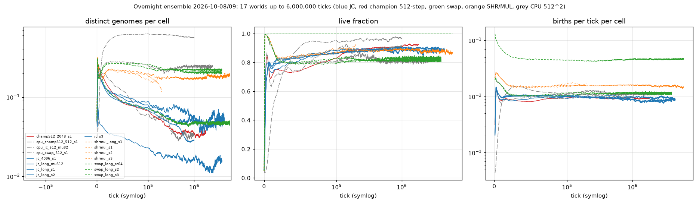

# Overnight ensemble 2026-10-08/09: 19 Life worlds, up to 6,000,000 ticks

Launched 19:11 Berlin on all nine GPUs and the CPUs of the four nodes (`cluster/overnight_plan.conf`, `cluster/overnight.py`);
17 runs finished by 06:58, the last two (the adler40 CPU world and the 2048^2 swap world on falke64) by about 10:30. No run went
extinct. Per-run rows, phenotypes of the dominant genomes and renders are in `ANALYSIS.md` (all 30 worlds); this file is the
overnight reading. Curves: `overnight_curves.png` (symlog time axis, per-cell quantities so that 512^2, 1024^2, 2048^2 and 4096^2
worlds can be compared).

| run | hardware | ticks | hours | ticks/s | live at end | min live (t >= 1000) | genomes at 200 k | at 1 M | at 2 M | at end | births/tick at end |
|---|---|---:|---:|---:|---:|---:|---:|---:|---:|---:|---:|
| jc_4096_s1 (JC, 4096^2) | RTX 4090 | 1,000,000 | 10.3 | 27 | 15,146,860 (90 %) | 3,258,501 | 902,578 | 480,892 | | 480,892 | 165,898 |
| champ512_2048_s1 (champion, 512-step clock, 2048^2) | RTX 4080 | 1,800,000 | 9.8 | 51 | 3,877,054 (92 %) | 1,242,528 | 210,544 | 149,025 | 147,312 | 147,312 | 38,504 |
| jc_long_s1 (JC, 1024^2) | RTX 3060 | 4,500,000 | 9.2 | 137 | 929,257 (89 %) | 215,352 | 63,826 | 52,979 | 50,449 | 56,598 | 9,257 |
| jc_long_s2 | RTX 3060 | 4,500,000 | 9.8 | 128 | 934,213 (89 %) | 194,467 | 71,090 | 56,607 | 45,094 | 56,828 | 9,290 |
| jc_long_mu512 (JC, mu_bits 512) | RTX 3060 | 4,000,000 | 8.9 | 125 | 913,431 (87 %) | 342,375 | 18,665 | 17,022 | 12,407 | 16,626 | 9,979 |
| jc_s3 (phase B) | RTX 3060 | 200,000 | 0.4 | 126 | 920,488 | 205,080 | 75,476 | | | 75,476 | 10,084 |
| swap_long_rc64 (swap, repro_cost 64) | R9700 | 6,000,000 | 7.0 | 239 | 1,046,058 (99.8 %) | 1,043,366 | 62,614 | 49,677 | 48,850 | 49,565 | 48,788 |
| swap_long_s2 | RX 9070 XT | 4,000,000 | 8.2 | 136 | 843,736 (80 %) | 831,548 | 232,652 | 234,485 | 234,303 | 234,061 | 11,472 |
| swap_long_s3 | RX 9060 XT | 4,000,000 | 7.2 | 154 | 862,490 (82 %) | 820,895 | 238,780 | 218,542 | 213,555 | 219,624 | 11,977 |
| swap_2048_s1 (swap, 2048^2) | R9700 | 3,000,000 | ~15 | ~56 | finishing | | | | | | |
| shrmul_long_s1 (Codex's SHR/MUL ISA) | R9700 | 6,000,000 | 4.2 | 395 | 909,254 (87 %) | 868,349 | 181,616 | 181,892 | 198,239 | 193,838 | 15,520 |
| shrmul_s1 / s2 / s3 (phase B) | R9700, R9700, RX 9070 XT | 200,000 | 0.2 to 0.4 | 127 to 236 | 925,152 / 967,574 / 932,602 | 857,648 to 868,349 | 181,616 / 123,640 / 176,261 | | | | 16,474 / 17,595 / 16,196 |
| cpu_jc_512_s1 (JC, 512^2, 18 CPU threads) | adler40 CPU | 2,500,000 | ~14 | ~50 | finishing | | | | | | |
| cpu_champ512_512_s1 (champion 512-step, 512^2) | knecht24 CPU | 1,000,000 | 13.8 | 20 | 239,178 (91 %) | 75,773 | 14,540 | 8,513 | | 8,513 | 2,518 |
| cpu_jc_512_mu32 (JC, mu_bits 32, 512^2) | specht32 CPU | 1,000,000 | 8.8 | 31 | 252,499 (96 %) | 8,824 | 161,012 | 148,065 | | 148,065 | 2,984 |
| cpu_swap_512_s1 (swap, 512^2) | falke64 CPU | 2,500,000 | 6.4 | 108 | 214,883 (82 %) | 205,116 | 57,743 | 63,201 | 65,200 | 62,958 | 2,888 |

## What the long runs say

- **The JC world's diversity loss stops.** At 200,000 ticks (yesterday's phase B) the JC worlds were still losing genomes. Over
  4,500,000 ticks both seeds settle between 45,000 and 57,000 genomes per 1024^2 (about 0.05 per cell) from 1,000,000 ticks on,
  with births and fill constant. The 4096^2 world shows the same per-cell density at 1,000,000 ticks (480,892 genomes, 0.029 per
  cell, still falling at that point as the 1024^2 worlds were). Low mutation (mu_bits 512) settles at 12,000 to 19,000.
- **The swap ISA keeps its diversity for millions of ticks**: 213,000 to 235,000 genomes per 1024^2 for the whole 4,000,000 ticks,
  with births constant. With cheap reproduction (repro_cost 64) it settles at about 49,000 with four times the births. Halting genomes
  make the cost landscape flat, so there is nothing to select on except the trigger table, and neutral drift keeps the pool wide.
- **Codex's SHR/MUL ISA behaves like the swap ISA, and runs fastest**: 182,000 to 198,000 genomes, slightly rising over 6,000,000 ticks,
  395 ticks/s on an R9700 (its genomes halt early). Its three phase-B seeds agree within 30 %.
- **The 512-step champion at 2048^2** settles at about 147,000 genomes (0.035 per cell) from 1,000,000 ticks on; the CPU control at 512^2
  settles at 8,500 (0.032 per cell). The extended clock does not destabilise the world.
- **Nothing went extinct** in 19 worlds over a combined 45,000,000 ticks; the lowest live fraction after the first 1,000 ticks was 9 %
  (the 4096^2 JC world during its first turnover wave).
- **Seeds agree, parameters decide**: the two JC seeds end within 0.4 % of each other at 4,500,000 ticks; the two swap seeds within 7 %.
  Mutation rate, reproduction cost and the ISA change the plateau by factors of 3 to 15.
