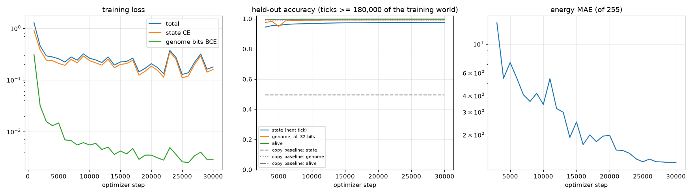

# Learned world model of Universe-1 Life (SWAP,ADD,NAND,JC world)

A convolutional net (`life/worldmodel.py`) trained on the RTX 4090 to predict the grid one tick ahead while the world ran on the
RTX 4080 (`u1life_cuda --dump-every 100`: grid pairs (t, t+1) every 100 ticks). Input per cell: 32 genome bits, state one-hot, alive,
energy, age, and the tick's neighbour direction; output: alive, state (16-way), 32 genome bits, energy at t+1. Circular 3x3 convolutions
(1.38 M parameters), random 256^2 crops, bf16 autocast, AdamW with a one-cycle schedule.

Training: 30,000 steps in 100.5 min on 1800 grid pairs (ticks < 180,000; reservoir of 400 pairs in RAM).
Test: 8 pairs with ticks >= 180,000 of the same world, and 8 pairs of an independent seed-2 world.

| metric (cells alive at t+1 unless noted) | model, same world | model, seed-2 world | copy-previous baseline |
|---|---:|---:|---:|
| alive at t+1 (all cells) | 99.77 % | 99.66 % | 99.41 % |
| state at t+1 | 97.62 % | 81.53 % | 49.64 % |
| genome at t+1, all 32 bits | 99.32 % | 98.64 % | 99.05 % |
| genome bits at t+1 (per bit) | 99.95 % | 99.88 % | - |
| energy at t+1, mean abs error (of 255) | 1.22 | 2.04 | - |

Reading the table: the state at t+1 is the output of running the cell's program on (state, neighbour state), so state accuracy measures
how much of the program semantics the net learned from observation; the copy baseline is how often the state simply does not change.
Genome accuracy measures the world rule (who colonises whom): the copy baseline is high because most cells keep their genome for a tick.
Random death (1/512 per tick) and mutation on copy are hash-driven and unpredictable from the grid, so 100 % is not reachable.
