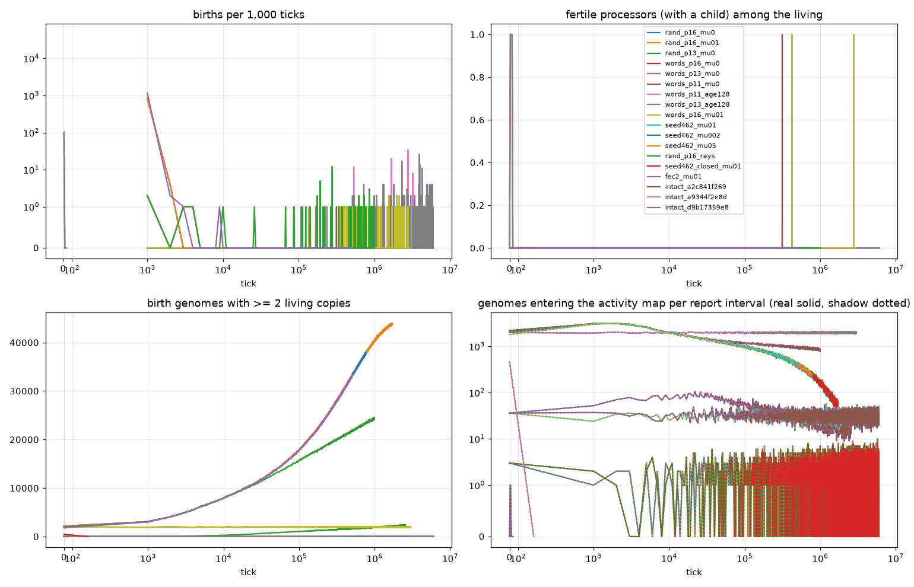
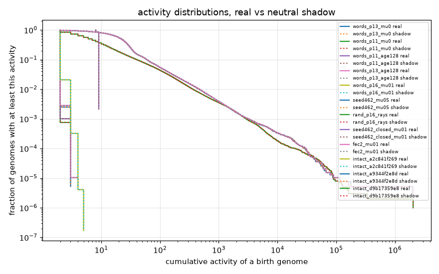

# Design C soup ensemble: analysis

Rules and predictions: `docs/12_design_c_soup.md`. Runs: `cluster/soup_runs.conf`. One row per run; "adaptive genomes" are
birth genomes whose cumulative activity (sum of census counts) exceeds the largest activity any genome of the neutral shadow reached.
Caveat: placements land on the same position by chance (about P^2 / 2N pairs among the living at any census), so identical genomes with 2 to 4
copies occur in every census of soup and shadow alike; the activity maps are mostly these collisions, and a chain whose members live 4 ticks
cannot exceed the shadow maximum. The chains of births (from births.tsv) are the sensitive measure of reproduction in this soup. Chains whose
root genome is uniform (all eight words equal, e.g. LDIND 7 x 8) are counted separately: such a genome is reproduced by any loop that writes
that constant into eight words, which happens when the processor has itself been overwritten; it is not a copy loop.

| run | processors | life (steps) | mu | inflow | ticks | births | faithful | chains | chains per M ticks | longest chain | genomes in map | shadow map | max activity real / shadow | adaptive genomes | verdict |
|---|---:|---:|---:|---|---:|---:|---:|---:|---:|---:|---:|---:|---|---:|---|
| rand_p16_mu0 | 65,536 | 1024 | 0 | processors | 1,654,000 | 4 | 3 | 2 | 1.2 | 2 | 0 | 0 | 0 / 0 | 0 | none: no genome outran the shadow |
| rand_p16_mu01 | 65,536 | 1024 | 0.01 | processors | 1,720,000 | 4 | 3 | 2 | 1.2 | 2 | 0 | 0 | 0 / 0 | 0 | none: no genome outran the shadow |
| rand_p13_mu0 | 8,192 | 1024 | 0 | processors | 2,549,000 | 0 | 0 | 0 | 0.0 | 0 | 0 | 0 | 0 / 0 | 0 | none: no birth at all |
| words_p16_mu0 | 65,536 | 1024 | 0 | random code | 2,097,000 | 26 | 19 | 24 | 11.4 | 2 | 0 | 0 | 0 / 0 | 0 | none: no genome outran the shadow |
| words_p13_mu0 | 8,192 | 1024 | 0 | random code | 6,000,000 | 38 | 30 | 20 | 3.3 | 14 | 190,535 | 190,400 | 3 / 3 | 0 | none: no genome outran the shadow |
| words_p11_mu0 | 2,048 | 1024 | 0 | random code | 6,000,000 | 8 | 8 | 7 | 1.2 | 2 | 11,952 | 11,937 | 3 / 3 | 0 | none: no genome outran the shadow |
| words_p11_age128 | 2,048 | 128 | 0 | random code | 6,000,000 | 128 | 112 | 46 | 7.7 | 34 | 11,857 | 11,857 | 3 / 3 | 0 | none: no genome outran the shadow |
| words_p13_age128 | 8,192 | 128 | 0 | random code | 6,000,000 | 233 | 194 | 138 | 23.0 | 26 | 190,980 | 190,980 | 4 / 4 | 0 | none: no genome outran the shadow |
| words_p16_mu01 | 65,536 | 1024 | 0.01 | random code | 3,000,000 | 37 | 25 | 35 | 11.7 | 2 | 5,896,516 | 5,896,124 | 5 / 5 | 0 | none: no genome outran the shadow |
| seed462_mu01 | 65,536 | 1024 | 0.01 | processors | 770,000 | 839 | 630 | 1 | 1.3 | 839 | 0 | 0 | 0 / 0 | 0 | none: no genome outran the shadow |
| seed462_mu002 | 65,536 | 1024 | 0.002 | processors | 765,000 | 843 | 672 | 1 | 1.3 | 843 | 0 | 0 | 0 / 0 | 0 | none: no genome outran the shadow |
| seed462_mu05 | 65,536 | 1024 | 0.05 | processors | 500,000 | 806 | 448 | 1 | 2.0 | 789 | 389,195 | 389,094 | 1,995,615 / 1,995,303 | 1 | transient: adaptive genomes only in the first third |
| rand_p16_rays | 65,536 | 1024 | 0 | processors | 1,000,000 | 70 | 66 | 6 | 6.0 | 1 | 1,005,571 | 1,005,580 | 2,042,588 / 2,042,556 | 1 | transient: adaptive genomes only in the first third |
| seed462_closed_mu01 | 65,536 | 1024 | 0.01 | none | 288 extinct | 12,767 | 10,973 | 1 | 3472.2 | 12767 | 462 | 462 | 9 / 9 | 0 | none: no genome outran the shadow |
| fec2_mu01 | 65,536 | 1024 | 0.01 | processors | 500,000 | 1,163 | 917 | 1 | 2.0 | 1136 | 387,615 | 387,592 | 2,038,170 / 2,038,117 | 1 | transient: adaptive genomes only in the first third |
| intact_a2c841f269 | 4,096 | 1024 | 0 | none | 39 extinct | 1 | 1 | 1 | 25641.0 | 1 | 1 | 1 | 6 / 6 | 0 | none: no genome outran the shadow |
| intact_a9344f2e8d | 4,096 | 1024 | 0 | none | 39 extinct | 1 | 1 | 1 | 25641.0 | 1 | 1 | 1 | 6 / 6 | 0 | none: no genome outran the shadow |
| intact_d9b17359e8 | 4,096 | 1024 | 0 | none | 39 extinct | 1 | 1 | 1 | 25641.0 | 1 | 1 | 1 | 6 / 6 | 0 | none: no genome outran the shadow |

## rand_p16_mu0: chains of births (stats rows; 2 chains, 1.2 per million ticks; size histogram {'2': 2})

| start tick | births | distinct genomes in the chain | root genome | faithful births | offsets |
|---:|---:|---:|---|---:|---|
| 1,000 | 2 | 0 | - | 0 |  |
| 3,000 | 2 | 0 | - | 0 |  |

## rand_p16_mu0: most abundant birth genomes at the last census (census_01600000.tsv)

| genome | count | first seen | disassembly |
|---|---:|---:|---|
| 0x0000000000 | 4068 | 1000 | LDIND 0; LDIND 0; LDIND 0; LDIND 0; LDIND 0; LDIND 0; LDIND 0; LDIND 0 |
| 0x39ce739ce7 | 312 | 1000 | LDIND 7; LDIND 7; LDIND 7; LDIND 7; LDIND 7; LDIND 7; LDIND 7; LDIND 7 |
| 0x0000000001 | 238 | 1000 | LDIND 1; LDIND 0; LDIND 0; LDIND 0; LDIND 0; LDIND 0; LDIND 0; LDIND 0 |
| 0x0800000000 | 188 | 1000 | LDIND 0; LDIND 0; LDIND 0; LDIND 0; LDIND 0; LDIND 0; LDIND 0; LDIND 1 |
| 0x0000000020 | 167 | 1000 | LDIND 0; LDIND 1; LDIND 0; LDIND 0; LDIND 0; LDIND 0; LDIND 0; LDIND 0 |

## rand_p16_mu01: chains of births (stats rows; 2 chains, 1.2 per million ticks; size histogram {'2': 2})

| start tick | births | distinct genomes in the chain | root genome | faithful births | offsets |
|---:|---:|---:|---|---:|---|
| 1,000 | 2 | 0 | - | 0 |  |
| 3,000 | 2 | 0 | - | 0 |  |

## rand_p16_mu01: most abundant birth genomes at the last census (census_01700000.tsv)

| genome | count | first seen | disassembly |
|---|---:|---:|---|
| 0x0000000000 | 4024 | 1000 | LDIND 0; LDIND 0; LDIND 0; LDIND 0; LDIND 0; LDIND 0; LDIND 0; LDIND 0 |
| 0x39ce739ce7 | 314 | 1000 | LDIND 7; LDIND 7; LDIND 7; LDIND 7; LDIND 7; LDIND 7; LDIND 7; LDIND 7 |
| 0x0000000001 | 237 | 1000 | LDIND 1; LDIND 0; LDIND 0; LDIND 0; LDIND 0; LDIND 0; LDIND 0; LDIND 0 |
| 0x0800000000 | 181 | 1000 | LDIND 0; LDIND 0; LDIND 0; LDIND 0; LDIND 0; LDIND 0; LDIND 0; LDIND 1 |
| 0x0000000020 | 166 | 1000 | LDIND 0; LDIND 1; LDIND 0; LDIND 0; LDIND 0; LDIND 0; LDIND 0; LDIND 0 |

## rand_p13_mu0: most abundant birth genomes at the last census (census_02500000.tsv)

| genome | count | first seen | disassembly |
|---|---:|---:|---|
| 0x0000000000 | 544 | 1000 | LDIND 0; LDIND 0; LDIND 0; LDIND 0; LDIND 0; LDIND 0; LDIND 0; LDIND 0 |
| 0x0000000001 | 35 | 1000 | LDIND 1; LDIND 0; LDIND 0; LDIND 0; LDIND 0; LDIND 0; LDIND 0; LDIND 0 |
| 0x0000000020 | 30 | 1000 | LDIND 0; LDIND 1; LDIND 0; LDIND 0; LDIND 0; LDIND 0; LDIND 0; LDIND 0 |
| 0x0800000000 | 30 | 2000 | LDIND 0; LDIND 0; LDIND 0; LDIND 0; LDIND 0; LDIND 0; LDIND 0; LDIND 1 |
| 0x0000000400 | 27 | 2000 | LDIND 0; LDIND 0; LDIND 1; LDIND 0; LDIND 0; LDIND 0; LDIND 0; LDIND 0 |

## words_p16_mu0: chains of births (stats rows; 24 chains, 11.4 per million ticks; size histogram {'1': 22, '2': 2})

| start tick | births | distinct genomes in the chain | root genome | faithful births | offsets |
|---:|---:|---:|---|---:|---|
| 1,550,000 | 2 | 0 | - | 0 |  |
| 1,971,000 | 2 | 0 | - | 0 |  |
| 137,000 | 1 | 0 | - | 0 |  |
| 174,000 | 1 | 0 | - | 0 |  |
| 352,000 | 1 | 0 | - | 0 |  |

## words_p16_mu0: most abundant birth genomes at the last census (census_02000000.tsv)

| genome | count | first seen | disassembly |
|---|---:|---:|---|
| 0xe5c807812d | 3 | 2000000 | STIND 5; STIND 1; LDIND 0; STIND 7; LDIND 0; LDIND 4; INCM 7; JNZ 4 |
| 0xff17b8968a | 3 | 2000000 | STIND 2; INCM 4; LDIND 5; INCM 1; JNZ 3; STIND 3; JNZ 4; JNZ 7 |
| 0xb6a614398b | 3 | 2000000 | STIND 3; STIND 4; STIND 6; STIND 0; LDIND 1; INCM 3; JNZ 2; INCM 6 |
| 0x50a52a5d4d | 3 | 2000000 | STIND 5; STIND 2; INCM 7; INCM 4; INCM 2; INCM 2; LDIND 2; STIND 2 |
| 0xad45a07395 | 3 | 2000000 | INCM 5; JNZ 4; JNZ 4; LDIND 0; JNZ 2; LDIND 2; INCM 5; INCM 5 |

## words_p13_mu0: chains of births (stats rows; 20 chains, 3.3 per million ticks; size histogram {'1': 14, '2': 5, '14': 1})

| start tick | births | distinct genomes in the chain | root genome | faithful births | offsets |
|---:|---:|---:|---|---:|---|
| 3,966,000 | 14 | 0 | - | 0 |  |
| 2,478,000 | 2 | 0 | - | 0 |  |
| 3,379,000 | 2 | 0 | - | 0 |  |
| 4,856,000 | 2 | 0 | - | 0 |  |
| 4,929,000 | 2 | 0 | - | 0 |  |

## words_p13_mu0: most abundant birth genomes at the last census (census_06000000.tsv)

| genome | count | first seen | disassembly |
|---|---:|---:|---|
| 0x97246b1cd4 | 2 | 6000000 | INCM 4; LDIND 6; LDIND 7; INCM 6; LDIND 6; INCM 2; JNZ 4; INCM 2 |
| 0x6c4b8f8eba | 2 | 6000000 | JNZ 2; INCM 5; LDIND 3; JNZ 7; JNZ 0; LDIND 5; INCM 1; STIND 5 |
| 0x1be97e9ce3 | 2 | 6000000 | LDIND 3; LDIND 7; LDIND 7; JNZ 5; INCM 7; INCM 4; STIND 7; LDIND 3 |
| 0xe6a771f60f | 2 | 6000000 | STIND 7; INCM 0; JNZ 5; LDIND 3; INCM 7; INCM 3; JNZ 2; JNZ 4 |
| 0x8ea7e26520 | 2 | 6000000 | LDIND 0; STIND 1; JNZ 1; LDIND 4; JNZ 6; INCM 3; JNZ 2; INCM 1 |

## words_p11_mu0: chains of births (stats rows; 7 chains, 1.2 per million ticks; size histogram {'1': 6, '2': 1})

| start tick | births | distinct genomes in the chain | root genome | faithful births | offsets |
|---:|---:|---:|---|---:|---|
| 4,929,000 | 2 | 0 | - | 0 |  |
| 315,000 | 1 | 0 | - | 0 |  |
| 2,766,000 | 1 | 0 | - | 0 |  |
| 3,243,000 | 1 | 0 | - | 0 |  |
| 3,902,000 | 1 | 0 | - | 0 |  |

## words_p11_mu0: most abundant birth genomes at the last census (census_06000000.tsv)

| genome | count | first seen | disassembly |
|---|---:|---:|---|
| 0x9717ed1e7a | 2 | 6000000 | JNZ 2; INCM 3; LDIND 7; JNZ 2; JNZ 6; STIND 3; JNZ 4; INCM 2 |
| 0xcbc4d38f8b | 1 | 6000000 | STIND 3; JNZ 4; LDIND 3; LDIND 7; STIND 5; LDIND 2; STIND 7; JNZ 1 |
| 0x4451605ce2 | 1 | 6000000 | LDIND 2; LDIND 7; INCM 7; LDIND 0; INCM 6; STIND 0; INCM 1; STIND 0 |
| 0xce5635c663 | 1 | 6000000 | LDIND 3; INCM 3; INCM 1; STIND 3; LDIND 3; STIND 3; JNZ 1; JNZ 1 |
| 0xc17fab0725 | 1 | 6000000 | LDIND 5; JNZ 1; LDIND 1; INCM 6; JNZ 2; JNZ 7; LDIND 5; JNZ 0 |

## words_p11_age128: chains of births (births.tsv; 46 chains, 7.7 per million ticks; size histogram {'1': 36, '2': 3, '4': 3, '8': 1, '12': 1, '20': 1, '34': 1})

| start tick | births | distinct genomes in the chain | root genome | faithful births | offsets |
|---:|---:|---:|---|---:|---|
| 2,782,813 | 34 | 1 | 0x3196777676 | 34 | 16 |
| 1,668,369 | 20 | 1 | 0xd460142c29 | 20 | 10 20 |
| 533,641 | 12 | 1 | 0x2e62880429 | 12 | 10 |
| 3,214,633 | 8 | 1 | 0xc9ac88180a | 8 | 11 |
| 4,928,033 | 4 | 1 | 0x8e91180429 | 4 | 10 |

## words_p11_age128: most abundant birth genomes at the last census (census_06000000.tsv)

| genome | count | first seen | disassembly |
|---|---:|---:|---|
| 0x9717ed1e7a | 2 | 6000000 | JNZ 2; INCM 3; LDIND 7; JNZ 2; JNZ 6; STIND 3; JNZ 4; INCM 2 |
| 0xf7e77a2cfa | 1 | 6000000 | JNZ 2; LDIND 7; STIND 3; INCM 4; INCM 7; INCM 3; JNZ 7; JNZ 6 |
| 0x37b03a1863 | 1 | 6000000 | LDIND 3; LDIND 3; LDIND 6; INCM 4; LDIND 3; JNZ 0; JNZ 6; LDIND 6 |
| 0xc17fab0725 | 1 | 6000000 | LDIND 5; JNZ 1; LDIND 1; INCM 6; JNZ 2; JNZ 7; LDIND 5; JNZ 0 |
| 0xfe111e185c | 1 | 6000000 | JNZ 4; LDIND 2; LDIND 6; JNZ 4; INCM 1; STIND 0; JNZ 0; JNZ 7 |

## words_p13_age128: chains of births (births.tsv; 138 chains, 23.0 per million ticks; size histogram {'1': 112, '2': 12, '3': 1, '4': 10, '11': 1, '17': 1, '26': 1})

| start tick | births | distinct genomes in the chain | root genome | faithful births | offsets |
|---:|---:|---:|---|---:|---|
| 3,927,917 | 26 | 2 | 0x3e55045ce9 | 25 | 9 |
| 2,308,707 | 17 | 2 | 0xd42285860a | 16 | 10 |
| 4,265,201 | 11 | 1 | 0xd1a08b18aa | 11 | 10 |
| 723,757 | 4 | 1 | 0x3e608b9caa | 4 | 10 |
| 1,294,574 | 4 | 1 | 0x02d0885ce8 | 4 | 9 |

## words_p13_age128: most abundant birth genomes at the last census (census_06000000.tsv)

| genome | count | first seen | disassembly |
|---|---:|---:|---|
| 0x97246b1cd4 | 2 | 6000000 | INCM 4; LDIND 6; LDIND 7; INCM 6; LDIND 6; INCM 2; JNZ 4; INCM 2 |
| 0x6c4b8f8eba | 2 | 6000000 | JNZ 2; INCM 5; LDIND 3; JNZ 7; JNZ 0; LDIND 5; INCM 1; STIND 5 |
| 0x1be97e9ce3 | 2 | 6000000 | LDIND 3; LDIND 7; LDIND 7; JNZ 5; INCM 7; INCM 4; STIND 7; LDIND 3 |
| 0xe6a771f60f | 2 | 6000000 | STIND 7; INCM 0; JNZ 5; LDIND 3; INCM 7; INCM 3; JNZ 2; JNZ 4 |
| 0x8ea7e26520 | 2 | 6000000 | LDIND 0; STIND 1; JNZ 1; LDIND 4; JNZ 6; INCM 3; JNZ 2; INCM 1 |

## words_p16_mu01: chains of births (births.tsv; 35 chains, 11.7 per million ticks; size histogram {'1': 33, '2': 2})

| start tick | births | distinct genomes in the chain | root genome | faithful births | offsets |
|---:|---:|---:|---|---:|---|
| 1,970,722 | 2 | 1 | 0xd452081140 | 2 | 9 |
| 2,127,748 | 2 | 1 | 0xd863043829 | 2 | 9 |
| 136,897 | 1 | 2 | 0x4e4a82d609 | 0 | 11 |
| 173,409 | 1 | 2 | 0x3eaf041fcf | 0 | 15 |
| 351,841 | 1 | 1 | 0x3e6173a34b | 1 | 12 |

## words_p16_mu01: most abundant birth genomes at the last census (census_03000000.tsv)

| genome | count | first seen | disassembly |
|---|---:|---:|---|
| 0x2f61d58c40 | 3 | 3000000 | LDIND 0; LDIND 2; LDIND 3; STIND 3; JNZ 5; INCM 0; JNZ 5; LDIND 5 |
| 0x2586284d8a | 3 | 3000000 | STIND 2; STIND 4; INCM 3; INCM 0; LDIND 2; LDIND 3; INCM 6; LDIND 4 |
| 0xcc838b23bd | 3 | 3000000 | JNZ 5; JNZ 5; STIND 0; INCM 6; JNZ 0; LDIND 1; INCM 2; JNZ 1 |
| 0x3a9f0f8f9a | 3 | 3000000 | JNZ 2; JNZ 4; LDIND 3; JNZ 7; INCM 0; STIND 7; STIND 2; LDIND 7 |
| 0x0e27e49785 | 3 | 3000000 | LDIND 5; JNZ 4; LDIND 5; STIND 1; JNZ 6; INCM 3; JNZ 0; LDIND 1 |

## seed462_mu01: chains of births (stats rows; 1 chains, 1.3 per million ticks; size histogram {'839': 1})

| start tick | births | distinct genomes in the chain | root genome | faithful births | offsets |
|---:|---:|---:|---|---:|---|
| 1,000 | 839 | 0 | - | 0 |  |

## seed462_mu01: most abundant birth genomes at the last census (census_00700000.tsv)

| genome | count | first seen | disassembly |
|---|---:|---:|---|
| 0x0000000000 | 4042 | 1000 | LDIND 0; LDIND 0; LDIND 0; LDIND 0; LDIND 0; LDIND 0; LDIND 0; LDIND 0 |
| 0x39ce739ce7 | 390 | 1000 | LDIND 7; LDIND 7; LDIND 7; LDIND 7; LDIND 7; LDIND 7; LDIND 7; LDIND 7 |
| 0x0000000001 | 225 | 1000 | LDIND 1; LDIND 0; LDIND 0; LDIND 0; LDIND 0; LDIND 0; LDIND 0; LDIND 0 |
| 0x0800000000 | 185 | 1000 | LDIND 0; LDIND 0; LDIND 0; LDIND 0; LDIND 0; LDIND 0; LDIND 0; LDIND 1 |
| 0x0000000400 | 161 | 1000 | LDIND 0; LDIND 0; LDIND 1; LDIND 0; LDIND 0; LDIND 0; LDIND 0; LDIND 0 |

## seed462_mu002: chains of births (stats rows; 1 chains, 1.3 per million ticks; size histogram {'843': 1})

| start tick | births | distinct genomes in the chain | root genome | faithful births | offsets |
|---:|---:|---:|---|---:|---|
| 1,000 | 843 | 0 | - | 0 |  |

## seed462_mu002: most abundant birth genomes at the last census (census_00700000.tsv)

| genome | count | first seen | disassembly |
|---|---:|---:|---|
| 0x0000000000 | 4041 | 1000 | LDIND 0; LDIND 0; LDIND 0; LDIND 0; LDIND 0; LDIND 0; LDIND 0; LDIND 0 |
| 0x39ce739ce7 | 381 | 1000 | LDIND 7; LDIND 7; LDIND 7; LDIND 7; LDIND 7; LDIND 7; LDIND 7; LDIND 7 |
| 0x0000000001 | 231 | 1000 | LDIND 1; LDIND 0; LDIND 0; LDIND 0; LDIND 0; LDIND 0; LDIND 0; LDIND 0 |
| 0x0800000000 | 181 | 1000 | LDIND 0; LDIND 0; LDIND 0; LDIND 0; LDIND 0; LDIND 0; LDIND 0; LDIND 1 |
| 0x0000000400 | 157 | 1000 | LDIND 0; LDIND 0; LDIND 1; LDIND 0; LDIND 0; LDIND 0; LDIND 0; LDIND 0 |

## seed462_mu05: adaptive genomes (activity above the shadow maximum 1,995,303)

| genome | first seen | last seen | activity | peak count | disassembly |
|---|---:|---:|---:|---:|---|
| 0x0000000000 | 1,000 | 500,000 | 1,995,615 | 4,213 | LDIND 0; LDIND 0; LDIND 0; LDIND 0; LDIND 0; LDIND 0; LDIND 0; LDIND 0 |

## seed462_mu05: chains of births (births.tsv; 1 chains, 2.0 per million ticks; size histogram {'789': 1}; 9 chains with 17 births of uniform genomes such as all LDIND 7 excluded)

| start tick | births | distinct genomes in the chain | root genome | faithful births | offsets |
|---:|---:|---:|---|---:|---|
| 1 | 789 | 576 | 0x0011045ce8 | 438 | 8 9 10 11 14 15 16 |

## seed462_mu05: most abundant birth genomes at the last census (census_00500000.tsv)

| genome | count | first seen | disassembly |
|---|---:|---:|---|
| 0x0000000000 | 3871 | 1000 | LDIND 0; LDIND 0; LDIND 0; LDIND 0; LDIND 0; LDIND 0; LDIND 0; LDIND 0 |
| 0x39ce739ce7 | 340 | 1000 | LDIND 7; LDIND 7; LDIND 7; LDIND 7; LDIND 7; LDIND 7; LDIND 7; LDIND 7 |
| 0x0000000001 | 245 | 1000 | LDIND 1; LDIND 0; LDIND 0; LDIND 0; LDIND 0; LDIND 0; LDIND 0; LDIND 0 |
| 0x0000000020 | 159 | 1000 | LDIND 0; LDIND 1; LDIND 0; LDIND 0; LDIND 0; LDIND 0; LDIND 0; LDIND 0 |
| 0x0000000400 | 151 | 1000 | LDIND 0; LDIND 0; LDIND 1; LDIND 0; LDIND 0; LDIND 0; LDIND 0; LDIND 0 |

## rand_p16_rays: adaptive genomes (activity above the shadow maximum 2,042,556)

| genome | first seen | last seen | activity | peak count | disassembly |
|---|---:|---:|---:|---:|---|
| 0x0000000000 | 1,000 | 1,000,000 | 2,042,588 | 3,855 | LDIND 0; LDIND 0; LDIND 0; LDIND 0; LDIND 0; LDIND 0; LDIND 0; LDIND 0 |

## rand_p16_rays: chains of births (births.tsv; 6 chains, 6.0 per million ticks; size histogram {'1': 6}; 44 chains with 64 births of uniform genomes such as all LDIND 7 excluded)

| start tick | births | distinct genomes in the chain | root genome | faithful births | offsets |
|---:|---:|---:|---|---:|---|
| 85,780 | 1 | 1 | 0x39c0039ce7 | 1 | 18 |
| 111,123 | 1 | 1 | 0x19ce739ce7 | 1 | 11 |
| 209,227 | 1 | 1 | 0x2108422484 | 1 | 23 |
| 263,883 | 1 | 2 | 0x39ce039ce7 | 0 | 15 |
| 646,660 | 1 | 1 | 0x39ce739cef | 1 | 15 |

## rand_p16_rays: most abundant birth genomes at the last census (census_01000000.tsv)

| genome | count | first seen | disassembly |
|---|---:|---:|---|
| 0x0000000000 | 1531 | 1000 | LDIND 0; LDIND 0; LDIND 0; LDIND 0; LDIND 0; LDIND 0; LDIND 0; LDIND 0 |
| 0x39ce739ce7 | 441 | 1000 | LDIND 7; LDIND 7; LDIND 7; LDIND 7; LDIND 7; LDIND 7; LDIND 7; LDIND 7 |
| 0x318c6318c6 | 204 | 1000 | LDIND 6; LDIND 6; LDIND 6; LDIND 6; LDIND 6; LDIND 6; LDIND 6; LDIND 6 |
| 0x0000000002 | 109 | 1000 | LDIND 2; LDIND 0; LDIND 0; LDIND 0; LDIND 0; LDIND 0; LDIND 0; LDIND 0 |
| 0x0000000001 | 107 | 1000 | LDIND 1; LDIND 0; LDIND 0; LDIND 0; LDIND 0; LDIND 0; LDIND 0; LDIND 0 |

## seed462_closed_mu01: chains of births (births.tsv; 1 chains, 3472.2 per million ticks; size histogram {'12767': 1})

| start tick | births | distinct genomes in the chain | root genome | faithful births | offsets |
|---:|---:|---:|---|---:|---|
| 1 | 12767 | 1430 | 0x0010abc0e8 | 10973 | 8 9 10 11 14 15 16 |

## seed462_closed_mu01: most abundant birth genomes at the last census (census_00000288.tsv)

| genome | count | first seen | disassembly |
|---|---:|---:|---|

## fec2_mu01: adaptive genomes (activity above the shadow maximum 2,038,117)

| genome | first seen | last seen | activity | peak count | disassembly |
|---|---:|---:|---:|---:|---|
| 0x0000000000 | 1,000 | 500,000 | 2,038,170 | 4,282 | LDIND 0; LDIND 0; LDIND 0; LDIND 0; LDIND 0; LDIND 0; LDIND 0; LDIND 0 |

## fec2_mu01: chains of births (births.tsv; 1 chains, 2.0 per million ticks; size histogram {'1136': 1}; 16 chains with 27 births of uniform genomes such as all LDIND 7 excluded)

| start tick | births | distinct genomes in the chain | root genome | faithful births | offsets |
|---:|---:|---:|---|---:|---|
| 1 | 1136 | 123 | 0x01b30b190e | 892 | 9 11 14 15 16 |

## fec2_mu01: most abundant birth genomes at the last census (census_00500000.tsv)

| genome | count | first seen | disassembly |
|---|---:|---:|---|
| 0x0000000000 | 4098 | 1000 | LDIND 0; LDIND 0; LDIND 0; LDIND 0; LDIND 0; LDIND 0; LDIND 0; LDIND 0 |
| 0x39ce739ce7 | 308 | 1000 | LDIND 7; LDIND 7; LDIND 7; LDIND 7; LDIND 7; LDIND 7; LDIND 7; LDIND 7 |
| 0x0000000001 | 248 | 1000 | LDIND 1; LDIND 0; LDIND 0; LDIND 0; LDIND 0; LDIND 0; LDIND 0; LDIND 0 |
| 0x0800000000 | 180 | 1000 | LDIND 0; LDIND 0; LDIND 0; LDIND 0; LDIND 0; LDIND 0; LDIND 0; LDIND 1 |
| 0x0000000020 | 155 | 1000 | LDIND 0; LDIND 1; LDIND 0; LDIND 0; LDIND 0; LDIND 0; LDIND 0; LDIND 0 |

## intact_a2c841f269: chains of births (births.tsv; 1 chains, 25641.0 per million ticks; size histogram {'1': 1})

| start tick | births | distinct genomes in the chain | root genome | faithful births | offsets |
|---:|---:|---:|---|---:|---|
| 6 | 1 | 1 | 0xa2c841f269 | 1 | 16 |

## intact_a2c841f269: most abundant birth genomes at the last census (census_00000039.tsv)

| genome | count | first seen | disassembly |
|---|---:|---:|---|

## intact_a9344f2e8d: chains of births (births.tsv; 1 chains, 25641.0 per million ticks; size histogram {'1': 1})

| start tick | births | distinct genomes in the chain | root genome | faithful births | offsets |
|---:|---:|---:|---|---:|---|
| 6 | 1 | 1 | 0xa9344f2e8d | 1 | 22 |

## intact_a9344f2e8d: most abundant birth genomes at the last census (census_00000039.tsv)

| genome | count | first seen | disassembly |
|---|---:|---:|---|

## intact_d9b17359e8: chains of births (births.tsv; 1 chains, 25641.0 per million ticks; size histogram {'1': 1})

| start tick | births | distinct genomes in the chain | root genome | faithful births | offsets |
|---:|---:|---:|---|---:|---|
| 6 | 1 | 1 | 0xd9b17359e8 | 1 | 21 |

## intact_d9b17359e8: most abundant birth genomes at the last census (census_00000039.tsv)

| genome | count | first seen | disassembly |
|---|---:|---:|---|

